- [Overview](#overview)
- [User stories](#user-stories)
    - [New User Stories](#new-user-stories)
    - [Registered User Stories](#registrered-user-stories)
    - [Admin User Stories](#admin-user-stories)
    - [Site Owner Stories](#site-user-stories)
- [UX](#ux)
    - [Strategy](#strategy)
    - [Scope](#scope)
    - [Structure](#structure)
    - [Skeleton](#skeleton)
- [Features](#features)
- [Technologies used](#technologies-used)
- [Resources](#resources)
- [Testing](#testing)
- [Code validity](#code-validity)
- [Version Control](#version-control)
- [Deployment](#deployment)
    - [Database Deployment](#database-deployment)
    - [Deployment Platform](#deployment-platform)
- [Credits](#credits)
- [Acknowledgments](#acknowledgments)

## **Smoothie Lovers**

## Demo
---

- A live demo can be found [here](https://eva-kuk.github.io/smoothie-lovers/)
- A github repository can be found [here]()

## Overview
---
- This is my third of Milestone Project 3 which is part of the Code Isntitute's FullStack Software Development Diploma Course and the main requirements is to build a full-stack website allowing users to manage a common dataset.
This project demonstrates the skills and knowledge of using the HTML5, CSS3, JavaScript, Python,the Flask framework, Jinja templating language and MongoDB in Back-End development which I have learned recently on the course.
- This is a Smoothie Lovers page, which was designed for all people who love smoothies and would like to find and share their own recipes with others. This page can also be used as a storage for users recipes collection and allow users to freely share their recipes with each other and to have handy to see the recipes anytime they need it. 
- The aim of the project is to create a recipe book wepsite with smoothies recipes which will be divided into 4 different categories to choose from. Upon registration, the user will receive their own accounts and will be able to save, modify and store their own recipes as well as share them with other registered users. 
The website is created in a responsive design that is very handy to see recipes from mobile devices to tablets or larger screens.
- The website was created for educational purposes.

## User stories
---
## New User Stories
1. As a  new visitor, I want to navigate the site easily, so that I can find what I need effectively.
2. As a new visitor, I want to be able to access the website on a desktop and also mobile devices, so that I won't be restricted from which device I can access the site. 
3. As a new visitor, I want to be able to follow or connect with the owner of the website on social media, so that I can see what else they are doing.
4. As a new visitor, I want to be able to contact the website owner, so thatI will be able to share my feedback regarding the website, ask any questions or recommendations that I may have.
5. As a new visitor, I want to browse other users recipes on the website without register, so that I can decide if I want to have account on that website.
6. As a new visitor, I want to have Register/Log In functions, so that I can have my own profile where I can keep track on my own recipes.
7. As a new visitor, I want to be able to filter recipes by ingredient, so that I can find recipes using ingredients I like.
8. As a new visitor, I want to see if there is any good kitchen tools recomendations, so that I can get some ideas what I might need to make smoothies.
7. As a user, I want to easily understand the purpose of this site.

## Registered User Stories
9. As a registered user, I want to add my own recipes for safe keeping I can easily find them and share it with others users from the website.
10. As a registered user, I want to edit my recipes, so that I can change them as I want.
11. As a registered user, I want to be able to remove my own recipes, so that I can maintain what recipes I have in my profile.
12. As a registered user, I want to get a confirmation message before deleting the recipe, so I won't delete recipe by mistake.

## Admin User Stories
13. As an admin user, I want to be able to edit/remove any recipes, so that I can maintain a the website well at a high level.
14. As an admin user, I want to be able to add/edit/remove categories, so that I can adapt to the changing needs of the website users.

## Site Owner Stories
15. As a site owner, I want to be able to promote a kitchen tools, so that the users can choose for themself the best option on trhe market.

## UX (5 planes)
---
This website design will target people, who are smoothie lovers and would like to have place where they can explore new smoothies recipes, keep and share their own recipes with others.
The main goal of this project was to create an online smoothie recipe book that will contain a collection of different smothis descriptions added by registered users in four different categories and will allow registered users to register to have their own account, add, edit, delete recipes and share them with other users. The collection consists of the following categories:
1. **Stay Healthy** - This category will include all smoothies recipes that contain ingredients which support our immune system to strengthen our body to prevent from colds, as well as these one that contain anti-inflammatory ingredients to keep our intestines in good condition, also these turbo charging our bodies with minerals and vitamins called vitamin bombs, so if put it in one word all these recipes that will keep us in a good health.
2. **Stay Young** - This category will include all smoothies recipes  contain ingredients that are powerful sources of radical-fighting antioxidants, anti-aging, rehydration and detoxifying rich-ingredients to keep our skin looking younger and in good condition at all ages.
3. **Stay Fit** - This category will include all smoothies that contain ingredients for all weight-watchers who counting their calories and want to loose some weight, to speed up our metabolism, but also smoohites for those who workout at the gym, who want to build up their mussles and are looking for high-protein meals so for all who want to keep in shape.
4. **Stay Happy** - This category includes all our favorite cocktails, not necessarily containing super healthy ingredients, but we like them because they are delicious.

1. ## **Strategy plane**
My goal for this project is to create a website with smoothies recipes where users will be able to store their recipes and share them with other users.
It is intended to be used as an full-stack application with clean and user - friendly site design.

### Project purpose:
- To create an easy-to-use online cocktail recipe book, providing a user-friendly interface with full functionality.
- Promoting a healthy lifestyle by introducing cocktails into our daily diet.

### Site owner goals:
- Present the recipe book and gain lots of great recipes in one place.
- Provide the contact form, so the users be able to get in touch with their queries. 
- Promote a brand of kitchen tools.

### Customer Goals:
- Easy to register and log in into the account.
- Easy to find and share recipes on the website.
- Easy to find links to social media accounts to follow the news about the website.
- Easy to find contact form for possible enquiries about profile or recipes.

2. ## **Scope plane**
To achieve user and owner’s goals, below are the minimum features to be included in this project. Also, CRUD functionality (Create, Read, Update, and Delete) is required for this project so these are implemented as a part of essential features.

CREATE— A function we can call when a new recipe is being added to the database. The user can supply the values for `category_name`, `recipe_name`, `ingredients_list`,`recipe_description `, `recipe_method` and `image_url`. The website admin has the capability to create new recipes category for selection.

READ — A function we call to retrive the information from database and display the results of all the recipes available currently in our database to read. All visitors to the website can browse all recipes without having to create an account.

UPDATE — A function we can call when information about a particular recipe needs to be changed. The user can edit the values for `recipe_name`, `ingredients_list`,`recipe_description `, `recipe_method` and `image_url`. After the function is called, the corresponding entry in the recipes database will contain the new fields provided. This option is only available to the creator of each recipe.The admin only can edit the values for `category_name`.

DELETE — A function we can call to remove a particular recipe from the catalog. This option is only available to the creator of the recipe. THe admin only can remove the values for `category_name`.

### Functional Requirements
- Mobile-first website that is responsive on all devices.
- Search by a keyword(s) function that users can search for specific recipes by `recipe_ingredients`
- 404 page that appears for invalid URL and takes users back to Home page of the website safely
- Register page where users can create an account to add, edit recipes.
- Create Recipe page where users can create and post their recipes.
- Edit Recipe page where users can edit their recipes.
- Delete Recipe function that users can delete their recipes.
- Manage Category page and functions that only admin user (owner) can create, edit and delete categories.
- Login page where users can log in to the website.
- Logout function that users can log out the website.
- Profile page where users can see all their recipes and access to create, post, edit and delete recipes.
- To have a straight forward interface, that allows the user to make choices about the content they wish to display.

### Content Requirements
- Much of the content on this site will be provided by users. 
- To ensure that the site immediately shows its purpose All the recipes are shown on Home page.
- Categories (Stay Healthy, Stay Young, Stay Fit, Stay Happy pages) where users can choose recipes by the categories.
- Utencils page where users can see some kitchen tools halping to prepare and store smoothiea linked to the seller’s website.
- Provides users with pure UX.

3. ## **Structure plane**

### FRONT END
Chart of the website to show core relations between the pages
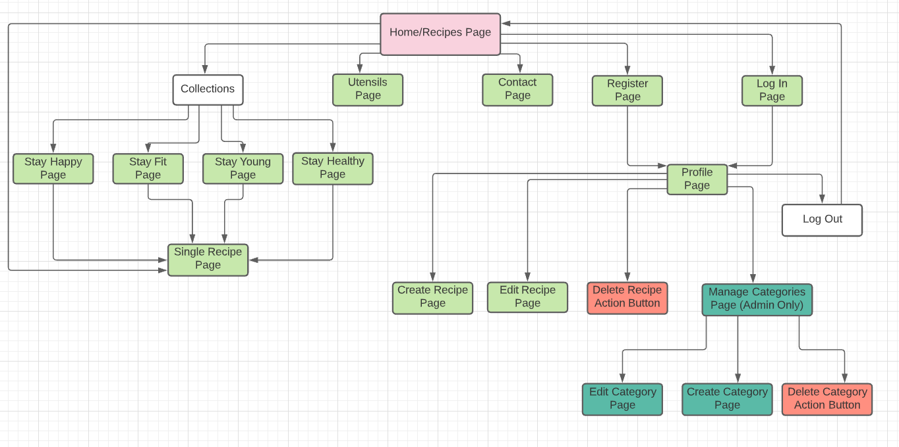

- **HOME/RECIPE PAGE** (index.html) - The Home/Recipe Page of the website will clearly outline the purpose of the website and contains all available recipes cards for the user to view. There is a sticky navigation at the top which is placed on all pages and contains logo and Recipe link which leads to Home page and a drop down Collection list with all Categories, Utensils Page, Contact Page, Register Page and Login Page. At the bottom of the page there is a footer that is also placed on all other pages, which contains a social media links.

- **COLLECTIONS PAGES:** - (categories<category_name>.html) - The pages where the user can view recipes selected from among all recipes displayed on the home page according to the category selected by him: Stay Healthy, Stay Young, Stay Fit, Stay Happy.

- **SINGLE RECIPE PAGE** (recipe.html) - The Single Recipe Page will be opened when the user wants more information about the recipe and provides a full description with an image.

- **UTENSILS PAGE** (utensils.html) - The Utensils Page will contain the carousel with images and suggestions of tools and kitchen appliances that are needed in the preparation of smoothies and will have links to pages where user can purchase the product.

- **LOG IN PAGE** (login.html) - The Log In Page allows users who already have an account to log in to their profile. Username must be between 5 and 20 characters, password must contain at least 8 characters, include upper and lower case letters and numbers. When user logged in successfully, they are redirected to their unique Proifile page where they can view, edit and delete their recipes. Additional tab Log Out is visible and Register tab is hidden after logging in.

- **REGISTER PAGE** (register.html) - The Register Page allows users to create an account by entering a distinct username and password. Username must be between 5 and 20 characters, password must contain at least 8 characters, include upper and lower case letters and numbers. When user reggistered successfully, they are redirected to their Profile page where they can add, edit, delete and view existing recipes. 

- **PROFILE PAGE** (profile/<username>.html) - The Profile Page is unique to each user and is available after user register successfully where they can add, edit, delete and view theit existing recipes. There is an option to create a new recipe from this page by clicking an "Add Recipe" button and that leads to Create Recipe page

- **CREATE RECIPE PAGE** (add_recipe.html) - The Create Recipe Page allows users to add a new recipe by submitting a form. The user need enter the fields for `recipe_name`, `category_name`,`recipe_description`, `image_url`, `recipe_ingredients`, `recipe_method`. The new recipe is displayed on the home page and the profile page.

- **EDIT RECIPE PAGE** (edit_recipe.html) - The Edit Recipe Page allows user to edit existing recipe by clicking the Edit/Delete Recipe button and changing submitted before recipe form on users Profile Page.

- **MANAGE CATEGORIES PAGE** (manage_categories.html) - The Manage Categories Page allows the website administrator to add, edit and delete existing category. Only admin user can have an access to this page by a navigation link that appears on Profile page for admin.

- **CREATE CATEGORIES PAGE** (add_categories.html) - The Create Categories Page allows the website administrator to add category. Only admin user can have an access to this page by a navigation link that appears on Profile page for admin.

- **EDIT CATEGORIES PAGE** (edit_categories.html) - TheEdit Categories Page allows the website administrator to edit existing category. Only admin user can have an access to this page by a navigation link that appears on Profile page for admin.

- **CONTACT PAGE** (contact.html) - The Contact Page allows user to fill a form request and will contain the name, email and message fields that are required to fill in by the user and will be sent to the owner.

### BACK END
To create a recipe user must register on the account. Upon registration, an account will be assigned to the user. All user's details like **username**, **password** and unique identification **id** key will be stored in a user collection database. As soon as user creates a new recipe, the **username** in **users collection** which is linked with **username** in **recipes collection** display  **created by: `username`** on the recipe. The `category_name` in **categories collection** is linked with `category_name` in **recipes collection** which will be used to retrieve data by `category_name` when user choose one of the collections four categories. Categories in categories collection are editable by admin so it is created as an independent collection. The data in all the collections are retrievable and can be identified by the key or unique id of the object.

Chart of the website to show core relations between the pages
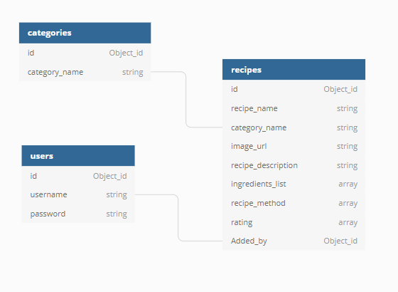

4. ## **Skeleton plane**
## Wireframe mockups:

**HOME/RECIPE PAGE**
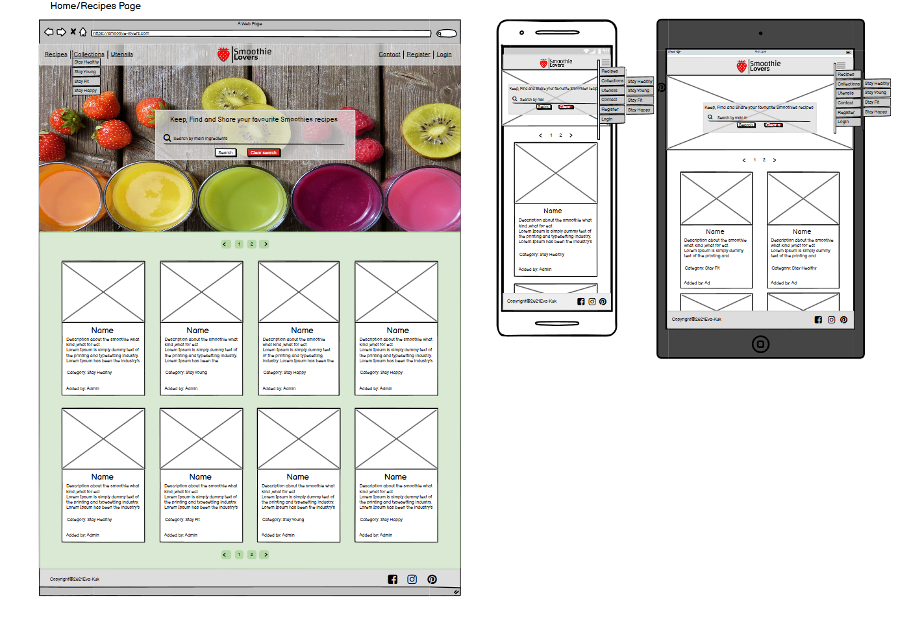

**COLLECTIONS PAGES:Stay Healthy/Stay Young/Stay Fit/ Stay Happy**

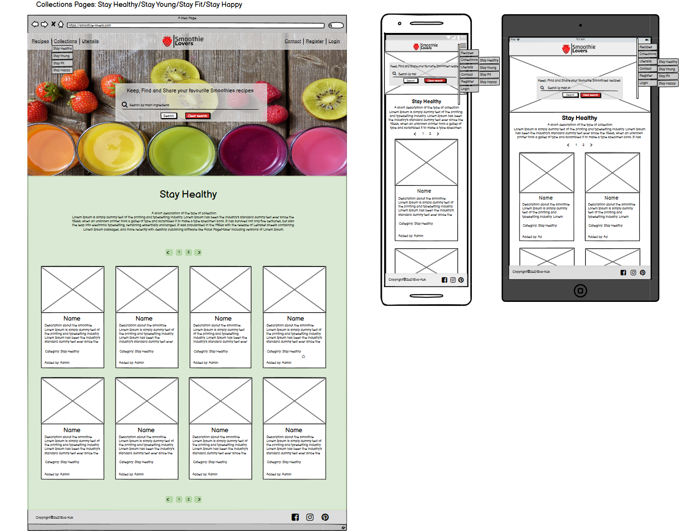

**UTENCILS PAGE**
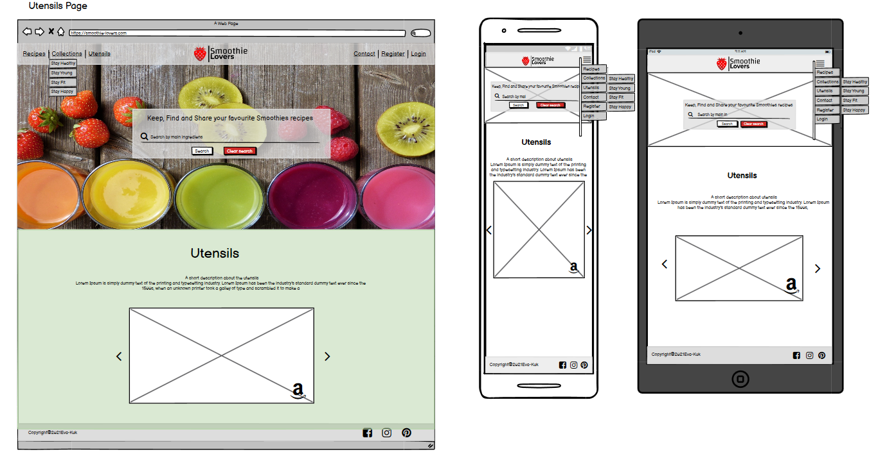

**SINGLE RECIPE PAGE**
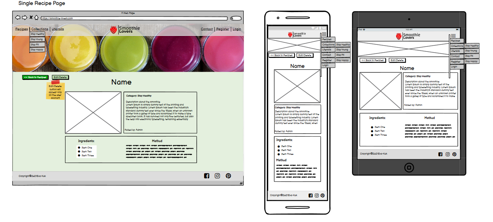

**ADD/EDIT/DELETE EXISTING RECIPE PAGE**
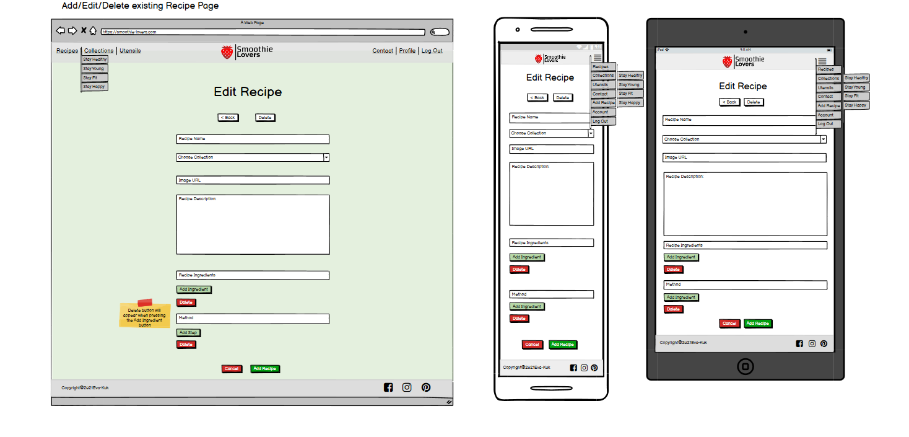

**PROFILE PAGE**
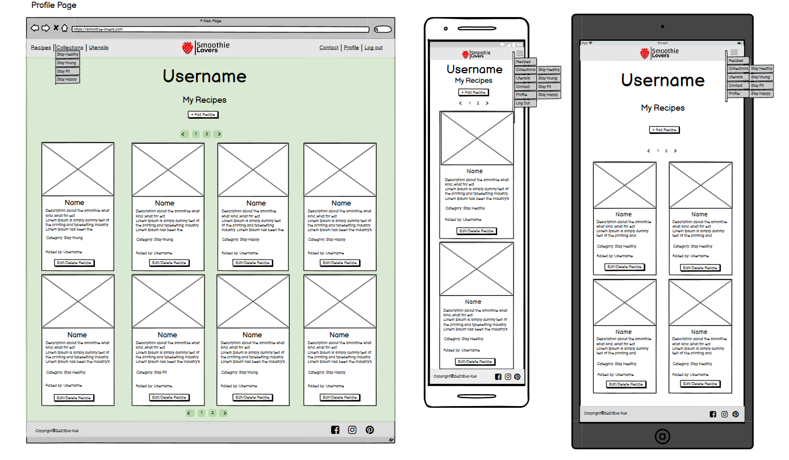

**MANAGE CATEGORIES PAGE**
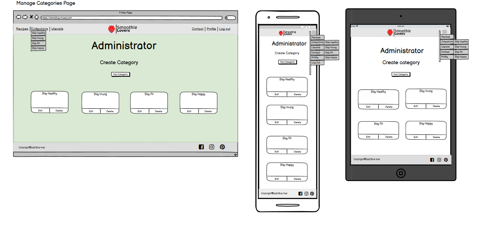

**REGISTER PAGE**
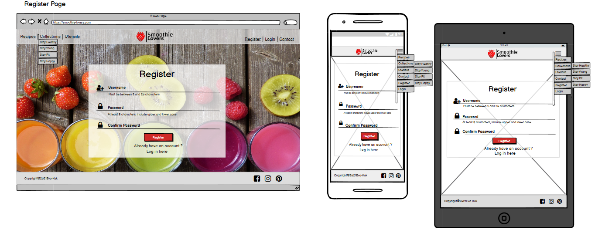

**LOGIN PAGE**
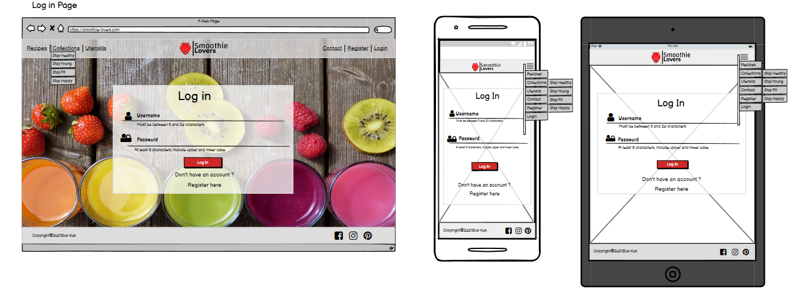

**CONTACT PAGE**
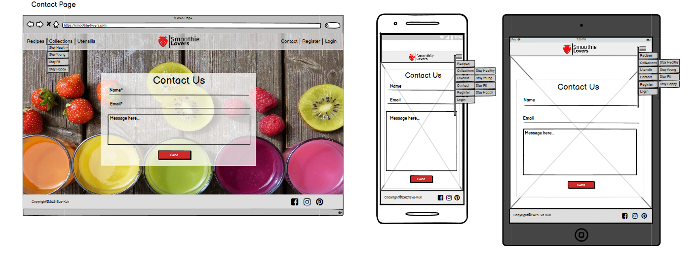

**5. Surface plane**
**Colors**
- As a first color I have choosen a **Red Pigment (# F72626)** which I used to design a logo brand, for a red strawberry, which not only symbolizes love and resembles a heart in shape, but also is one of the most frequently chosen fruits in the production of smoothies and I thought it will nicely complement the brand name.
- As a complementary colors for buttons I have chosen **Forrest Green Web** (#008F2B) which symbolizes health, nature and freshness and a different shade of red called **Venetian Red(#C41C1C)**.
- As a background color I have chosen the color which is being the shade of Forest Green Web called **HoneyDew (#EBFFF1)** because it is very close to white, which will provide a high contrast for darker text, while is.
- As a text color I have chosen Xicetic(#140101) which is the darkest option of for Red Pigment color.
- For navigation bar and footer I have chosen a shade of gray called Gainsboro (#E0E0E0) which will 
give the website a final touch and will not make it overloaded.
- The appropriate shade and saturation of all colours I have chosen by using the 
[adobe color generator tool](https://color.adobe.com/create/color-wheel)
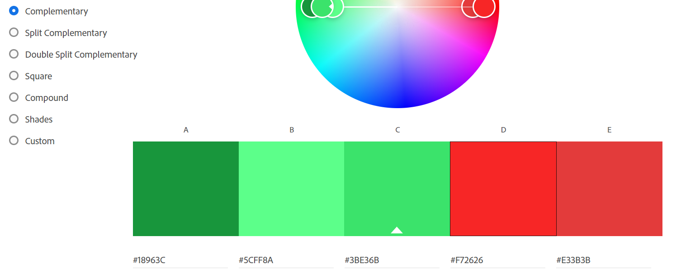 and 
[color generator](https://coolors.co/f72626-c41c1c-008f2b-140101-ebfff1-e0e0e0)
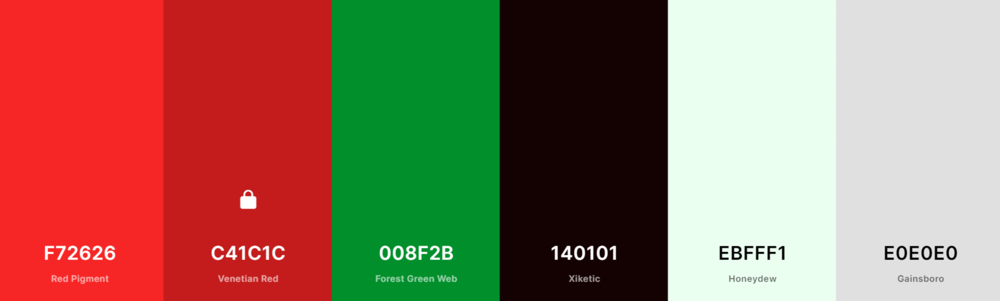 

 **Typography**
- For the main headings and creating a logo for  “Smoothie Lovers”  I have selected the **“Changa”** font with the group of fall-back font of **"sans-serif”**. I have chosen that font because of its originality, which aims to make the brand unique on the one hand, as well as simplicity, clear, easy do read and I feel suits the overall look of the website. 
- For the content I have chosen **"Open Sans"** with fallback of **"sans-serif"**, which according to 
[Vistaprint]( https://www.vistaprint.com/hub/design-decoded-top-12-easy-read-fonts?couponAutoload=1&GP=07%2f06%2f2021+14%3a38%3a39&GPS=6008954092&GNF=0 ) 
article is optimized for print, web, and mobile interfaces and is one of the best fonts easy to read and also one of the most popular font used for the food industry design according to article in 
[line25]( https://line25.com/fonts/best-fonts-for-food-industry-design).
- Both fonts match well according to [google fonts ](https://fonts.google.com/specimen/Changa?query=changa#standard-styles)

 **Images**
- Due to the shape of the site, which itself will contain a lot of different images with smoothies recipes, I have decided to choose just one main image which will to be placed on the rest of the pages and its reduced version on the **Single Recipe Page** to maintain consistency and not overload the page in color. The image has been carefully selected and distributed by 
[pixabay free resource]( https://pixabay.com/photos/smoothies-juice-fruit-colorful-3809517/) and it will allude to the theme of the page
Most of the recipe images are added by the user .

The default image if the don’t enter anything has taken from [here]()

## Features
---
**Existing Features**

#### Navigation bar:

#### Footer:

#### Home Page:

#### About Page:

#### Attractions Page:

#### Contact Page

### HOME PAGE

 
 ### ABOUT PAGE

### ATTRACTIONS PAGE 

### CONTACT PAGE 

**Features Left to Implement when skills develop**

## Technologies Used
**1. Languages**
-	 – HTML5
-	- CSS3 
-	- Python
-	 – JavaScript for interaction

**2. Integrations**
-	 - The project uses the Flask micro-web framework and links with jinja to create the webpages.
-	 - The project uses the Werkzeug WSGI library to manage the Web Server Gateway Interface and related tasks.
-	 -  The project uses the Jinja templating engine.
-	 – The project uses Materialize to aid in responsive design and conforming to the google material design language.
-	 - Font Awesome was the source of all icons.
-	 - Fonts used on the website courtesy of Google Fonts
-	 - The project uses JQuery to simplify DOM manipulation.

**3. Database Management System**
-	  - MongoDB was the chosen NoSQL database for this website.
-	 - MongoDB Atlas was the cloud database service used to host.the database.

**4.Version Control, storage and hosting**
-	 - Main workspace IDE (Integrated Development Environment)
-	 – Distributed Version Control tool to store versions of files and track changes.
-	  - Used to store the project repository and deploy the site via github pages.
-  - Heroku was used in order to deploy the website

**5.Editors**
-	[Typora]( https://typora.io/) - Typora was used to simplify creation of the README.md file.
-	[dbdiagram]( https://dbdiagram.io/home) - Used to create Entity Relationship Diagrams of the database.
-	[balsamiq]( https://balsamiq.com/) - Wireframing design tool to create wireframes.

**6.IDE Extensions used in GitPod**
- Auto Close Tag
- Prettier - Code Formatter
- Bracket Pair Colorizer
- Code spell Checker
- FontAwesome Auto-complete

**5. Other**

---

## Resources
- [cloudinary](https://cloudinary.com/) - Cloudinary is being used to access the image through cloud and edited the images as well using it.
- [Code Institute Course Content](https://courses.codeinstitute.net/login) -Main source of fundamental knowledge.
- Code Institute SLACK Community - Source of assistance.
- [Responsinator](http://www.responsinator.com/) - Responsive website mock up image generator.
- [Am I Responsive?](http://ami.responsivedesign.is/) - used to check how the website will look on different devices.
- [Autoprefixer](https://autoprefixer.github.io/) - used to add vendor prefixes.
- [Google chrome developer tools](https://developer.chrome.com/docs/devtools/) - used to check page elements, help debug issues with the site layout and test different CSS styles and console JS.
- [w3schools](https://www.w3schools.com/) - used as general source of knowledge.
- [Stack Overflow](https://stackoverflow.com/) - used as general source of knowledge.
- [Colors](https://coolors.co/) - color schemes generator.
- [Contrast checker](https://webaim.org/resources/contrastchecker/) -contrast color checker.
- [TinyPNG](https://tinypng.com/) - Efficient compression of images for site.
- [RedKetchup](https://redketchup.io/) -  to convert an image into a favicon and edit icons for used technologies.
- [Grammarly](https://www.grammarly.com/) - used to help with grammar check.
- [youtube](https://www.youtube.com/) - used for general resourse.
---
## Testing
- Click [here](TESTING.md) for the full testing process.

Overview
- [Encountered Issues](TESTING.md#encounteredissues)
- [Code Validation](TESTING.md#code-validation)
- [Testing User stories](TESTING.md#testing-user-stories)
- [Testing Functionality](TESTING.md#testing-functionality)
- [Testing Compatibility](TESTING.md#testing-compatibility)
- [Testing Accessibility](TESTING.md#testing-accessibility)
- [Testing Performance](TESTING.md#testing-performance)
- [Further Testing](TESTING.md#further-testing)

---
## Code validity

## Version Control

## Deployment

### Database Deployment

### Deployment Platform

---

## Credits

**Media**

**Content**

**Code Snippets**

## Acknowledgments
