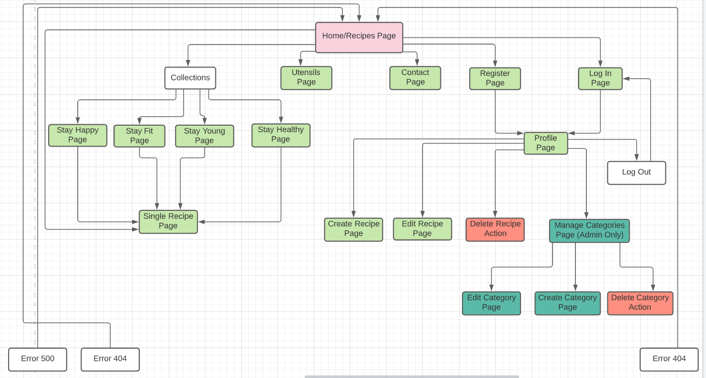
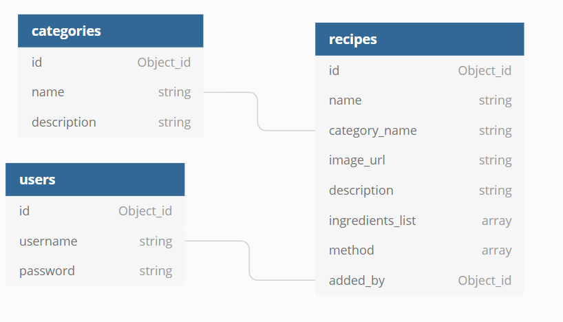
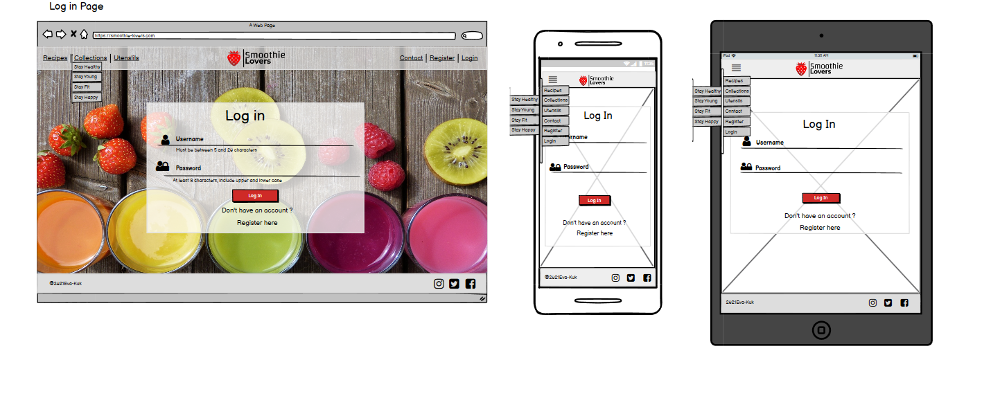
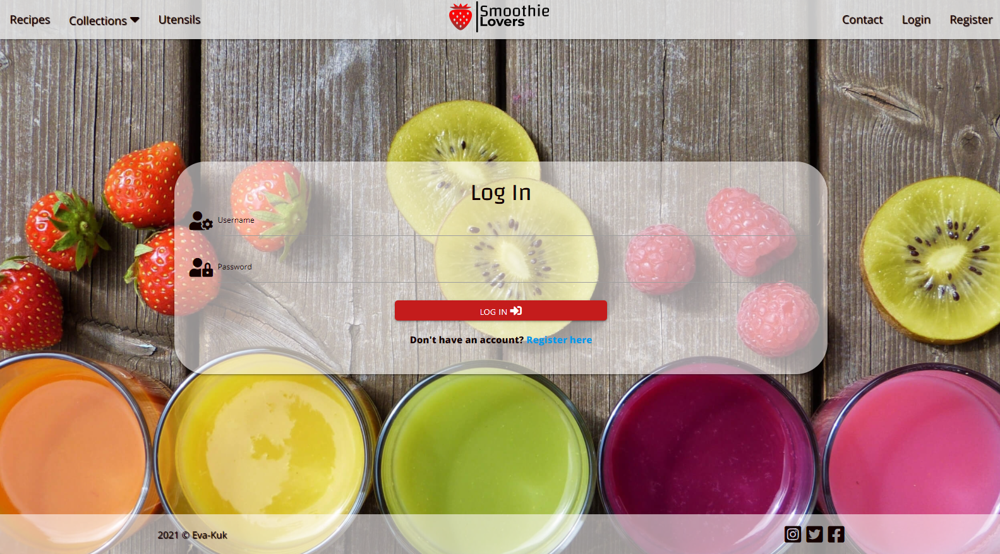
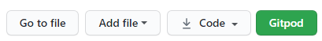

- [Overview](#overview)
- [User stories](#user-stories)
    - [New User Stories](#new-user-stories)
    - [Registered User Stories](#registrered-user-stories)
    - [Admin User Stories](#admin-user-stories)
    - [Site Owner Stories](#site-user-stories)
- [UX](#ux)
    - [Strategy](#strategy)
    - [Scope](#scope)
    - [Structure](#structure)
    - [Skeleton](#skeleton)
- [Features](#features)
- [Technologies used](#technologies-used)
- [Resources](#resources)
- [Defensive Design](#defensive-design)
- [Testing](#testing)
- [Code validity](#code-validity)
- [Version Control](#version-control)
- [Deployment](#deployment)
    - [Database Deployment](#database-deployment)
    - [Deployment Platform](#deployment-platform)
- [Credits](#credits)
- [Acknowledgments](#acknowledgments)

## **Smoothie Lovers**

## Demo
---

- A live demo can be found >>>[here](https://smoothie-lovers-flask-app.onrender.com)
- A github repository can be found >>> [here](https://github.com/Eva-Kuk/smoothie-lovers)

## Overview
---
- This is my third Milestone Project which is part of the Code Institute's FullStack Software Development Diploma Course and the main requirement of the project is to build a full-stack website allowing users to manage a common dataset.
This project demonstrates the skills and knowledge of using the HTML5, CSS3, JavaScript, Python, the Flask framework, Jinja templating language and MongoDB in Back-End development, which I have learned recently on the course.
- This is a Smoothie Lovers page, which was designed for all people who love smoothies and would like to find and share their own recipes with others. This page can also be used as a storage for users recipes collection and allow users to freely share their recipes with each other and to have a handy way to see the recipes anytime they need it. 
- The aim of the project is to create a recipe book website with smoothie recipes which will be divided into 4 different categories to choose from. Upon registration, the user will receive their own account and will be able to save, modify and store their own recipes as well as share them with other registered users. 
The website is created in a responsive design that is very handy to see recipes from mobile devices to tablets or larger screens.
- The website was created for educational purposes.

## User Stories
---
## New User Stories
1. As a new visitor, I want to navigate the site easily, so that I can find what I need effectively.
2. As a new visitor, I want to be able to access the website on a desktop or mobile device, so that I won't be restricted from which device I can access the site. 
3. As a new visitor, I want to be able to follow or connect with the owner of the website on social media, so that I can see what else they are doing.
4. As a new visitor, I want to be able to contact the website owner, so that I will be able to share my feedback regarding the website, ask any questions or recommendations that I may have.
5. As a new visitor, I want to browse other users recipes on the website without register, so that I can decide if I want to have an account on that website.
6. As a new visitor, I want to have Register/Log In functions, so that I can have my own profile where I can keep track on my own recipes.
7. As a new visitor, I want to be able to filter recipes by ingredient, so that I can find recipes using ingredients I like.
8. As a new / existing user, I want to be able to search recipes by category, so that I can find a recipe according to the category they belong to.
9. As a new visitor, I want to see if there is any good kitchen tools recommendations, so that I can get some ideas what I might need to make smoothies.
10. As a user, I want to easily understand the purpose of this site.

## Registered User Stories
11. As a registered user, I want to add my own recipes for safe keeping, so I can easily find them and share it with other users from the website.
12. As a registered user, I want to edit my recipes, so that I can change them as I want.
13. As a registered user, I want to be able to remove my own recipes, so that I can maintain which recipes I have in my profile.
14. As a registered user, I want to get a confirmation message before deleting the recipe, so I won't delete a recipe by mistake.

## Admin/Owner User Stories
15. As an admin user, I want to be able to add/edit/remove categories, so that I can adapt to the changing needs of the website users.

## Site Owner Stories
16. As a site owner, I want to be able to promote a range of kitchen tools, so that the users can choose for themselves the most appropriate option on the market.

## UX (5 planes)
---
This website design will target people, who are smoothie lovers and would like to have a place where they can explore new smoothie recipes, keep and share their own recipes with others.
The main goal of this project was to create an online smoothie recipe book that will contain a collection of different smoothie descriptions added by registered users in four different categories and will allow registered users to register to have their own account, add, edit, delete recipes and share them with other users. The collection consists of the following categories:
- **Stay Healthy** - This category will include all smoothie recipes that contain ingredients which support our immune system to strengthen our body to prevent it from colds. Moreover, these smoothies will contain anti-inflammatory ingredients to keep our digestive system in good condition, also turbo charging our bodies with minerals and vitamins called vitamin bombs.Hence, all these recipes that will keep us in good health.
- **Stay Young** - This category will include all smoothie recipes, which contain ingredients that are powerful sources of radical-fighting antioxidants, anti-aging, rehydration and detoxifying rich-ingredients to keep our skin looking younger and in good condition at any age.
- **Stay Fit** - This category will include all smoothies that contain ingredients for all weight-watchers, who count their calories and want to lose some weight, to speed up their metabolism, but also smoothies for those who workout at the gym, who want to build up their muscles and are looking for high-protein meal replacements. Hence, these smoothies are for people who want to keep in shape.
- **Stay Happy** - This category includes all our favourite smoothies, not necessarily containing super healthy ingredients, but we like them because they are delicious.

## **1. Strategy Plane**
My goal for this project is to create a website with smoothie recipes, where users will be able to store their recipes and share them with other users.
It is intended to be used as a full-stack application with clean and user - friendly site design.

### Project Purpose:
- To create an easy-to-use online smoothie recipe book, providing a user-friendly interface with full functionality.
- Promoting a healthy lifestyle by introducing smoothies into our daily diet.

### Site Owner Goals:
- Present a recipe book and collect lots of great recipes in one place.
- Provide a contact form, so users will be able to get in touch with their queries. 
- Promote a brand of kitchen tools.

### Customer Goals:
- Easy to register and log into the account.
- Easy to find and share recipes on the website.
- Easy to find links to social media accounts to follow news about the website.
- Easy to find contact form for possible enquiries regarding the personal profile or recipes.

## **2. Scope Plane**
To achieve user and owner’s goals, below are the minimum features to be included in this project. Also, CRUD functionality (Create, Read, Update, and Delete) is required for this project so these are implemented as a part of the essential features.

CREATE — A function we can call when a new recipe is being added to the database. The user can supply the values for `category_name`, `name`, `ingredients_list`, `description `, `method`, `serves`, `calories` and `image_url`. The website admin has the capability to create new recipe categories for selection and suply the category values for `name` and `description`.

READ — A function we call to retrieve information from the database and display the results of all the recipes currently available to read in our database. All visitors to the website can browse all recipes without having to create an account.

UPDATE — A function we can call when information about a particular recipe needs to be changed. The user can edit the values for `category_name`, `name`, `ingredients_list`, `description `, `method`, `serves`, `calories` and `image_url`. After the function is called, the corresponding entry in the recipes database will contain the new fields provided. This option is only available to the creator of each recipe.The admin only can edit the category values for `name` and `description`.

DELETE — A function we can call to remove a particular recipe from the catalog. This option is only available to the creator of the recipe. The admin only can remove the  category values for `name` and `description`.

### Functional Requirements
- Mobile-first website that is responsive on all devices.
- Search by a keyword(s) function that users can search for specific recipes by `ingredients`.
- 404 page that appears for invalid URL and takes users back to 'Home Page' of the website safely.
- 403 Forbiden page appears for denied access.
- 500 Internal Server Error appears server error response code indicates that the server encountered an unexpected condition that prevented it from fulfilling the request.
- Register page where users can create an account to add and edit recipes.
- Create Recipe page where users can create and post their recipes.
- Edit Recipe page where users can edit their recipes.
- Delete Recipe function that users can delete their recipes.
- Manage Category page and functions that only admin user (owner) can create, edit and delete categories.
- Login page where users can log in to the website.
- Logout function where users can log out of the website.
- Profile page where users can see all their recipes and access to create, post, edit and delete recipes.
- To have a straight forward interface, that allows the user to make choices about the content they wish to display.

### Content Requirements
- Much of the content on this site will be provided by users. 
- To ensure that the site immediately shows its purpose all the recipes are shown on Home page.
- Categories (Stay Healthy, Stay Young, Stay Fit, Stay Happy pages) where users can choose recipes by the categories.
- Utensils page where users can see some kitchen tools used to prepare and store smoothies linked to the seller’s website.
- Provides users with pure UX.

## **3. Structure Plane**

### FRONT END
Chart of the website to show core relations between the pages.

- **HOME/RECIPE PAGE** (recipes.html) - The Home/Recipe Page of the website will clearly outline the purpose of the website and contain all available recipe cards for the user to view. There is a sticky navigation at the top which is placed on all pages and contain logo and recipe links, which lead to the Home Page and a drop down Collection List with all Categories, Utensils Page, Contact Page, Register Page and Login Page. At the bottom of the page there is a footer that is also placed on all other pages, which contains social media links.

- **COLLECTIONS PAGES:** - (categories<category_name>.html) - These are the pages, where the user can view recipes selected from among all recipes displayed on the home page according to the category selected by them: Stay Healthy, Stay Young, Stay Fit, Stay Happy.

- **SINGLE RECIPE PAGE** (recipe.html) - The Single Recipe Page will be opened when the user wants more information about the recipe and provides a full description with an image.

- **UTENSILS PAGE** (utensils.html) - The Utensils Page will contain a carousel with images and suggestions of tools and kitchen appliances that are needed in the preparation of smoothies and will have links to pages where user can purchase the product.

- **LOG IN PAGE** (login.html) - The Log In Page allows users who already have an account to log in to their profile. Username must be between 5 and 20 characters, password must be between 5 and 20 characters,and can include upper and lower case letters and numbers. When the user logs in successfully, they are redirected to their unique profile page where they can view, edit and delete their recipes. An additional tab 'Log Out' is visible and a Register Tab is hidden after logging in.

- **REGISTER PAGE** (register.html) - The Register Page allows users to create an account by entering a distinct username and password. Username must be between 5 and 20 characters, password must be between 5 and 20 characters, include upper and lower case letters and numbers. When the user registers successfully, they are redirected to their Profile Page where they can add, edit, delete and view existing recipes.

- **PROFILE PAGE** (profile.html) - The Profile Page is unique to each user and is available after the user registers successfully where they can add, edit, delete and view their existing recipes. There is an option to create a new recipe from this page by clicking an "Add Recipe" button and that leads to the Create Recipe page.

- **CREATE RECIPE PAGE** (add_recipe.html) - The Create Recipe Page allows users to add a new recipe by submitting a form. The user needs to enter the required fields for `name`, `category_name`,`serves`, `calories`, `description`, `image_url`, `ingredients_list`, `method`. The new recipe is displayed on the Home Page and the Profile Page.

- **EDIT RECIPE PAGE** (edit_recipe.html) - The Edit Recipe Page allows users to edit existing recipes by clicking the Edit Recipe button beside Delete recipe button and to change recipes submitted in the past using the form in the Profile Page.

- **MANAGE CATEGORIES PAGE** (manage_categories.html) - The Manage Categories Page allows the website administrator to add, edit and delete existing category. Only admin users can have access to this page by a navigation link that appears on the admin's Profile Page.

- **CREATE CATEGORIES PAGE** (add_category.html) - The Add Category Page allows the website administrator to add a category. Only admin user can have an access to this page by a navigation link or button that appears on the admin's Profile Page.

- **EDIT CATEGORIES PAGE** (edit_category.html) - The Edit Category Page allows the website administrator to edit existing categories. Only admin users can have access to this page by a navigation link that appears on the admin's Profile Page.

- **CONTACT PAGE** (contact.html) - The Contact Page allows users to fill a form request, which contains: the email and message fields that are required to be filled in by the user and on submission will be sent to the owner.

### BACK END
To create a recipe the user must register on the website. Upon registration, an account will be assigned to the user. All user's details like **username**, **password** and unique identification **id** key will be stored in a user collection database. As soon as a user creates a new recipe, the **username** in **users collection** which is linked with **username** in **recipes collection** will display  **created by: `username`** on the recipe. The `name` in **categories collection** is linked with `category_name` in **recipes collection** which will be used to retrieve data by `category_name` when user chooses one of the four categories. Categories in the collection of categories can be edited by the admin, in order to create it as an independent collection. The data in all the collections are retrievable and can be identified by the key or unique id of the object.

Chart of the website to show core relations between available pages.

## **4. Skeleton Plane**
## Wireframe mockups initial:
- [home page (recipes.html)](wireframes/home-page.png)

- [collections page](wireframes/collections-pages.png)

- [utensils page](wireframes/utensils-page.png)

- [single recipe page](wireframes/single-recipe-page.png)

- [profile](wireframes/profile-page-new.png)

- [add-edit-delete-recipe page](wireframes/add-edit-recipe-page-new.png)

- [manage categories page](wireframes/manage-categories-page.png)

- [register page](wireframes/register-page.png)

- [login page](wireframes/login-page.png)

- [contact page](wireframes/contact-page.png)

### Wireframe mockups Final:

**HOME/RECIPE PAGE**

**COLLECTIONS PAGES: Stay Healthy / Stay Young / Stay Fit / Stay Happy**

**UTENSILS PAGE**
Initially, the Utensils page was planned using a carousel for display utensils, however I have decided to use the cards instead. That seemed to be a better UX solution to present the utensils in a simple form that could be seen immediately after entering the visitor the website without having to scroll items like in the case of the carousel.

**SINGLE RECIPE PAGE**
The size of the photo has been slightly changed for a visual appearance, as well as the Delete and Edit buttons have been added for users in session, making it easier for users to manage their recipes from any place on the website.

**PROFILE PAGE**
Profiles have been gently changed. The `Manage Categories` link on the admin page has been changed to the button and moved from the navigation bar to the page. The reason for the transfer was too many links on the navigation bar, which in smaller screens caused them to overlap the `Smoothie Lovers` logo. Taking into account the advice I received from my friends and family who tested my website, a New Recipe button was also added on the website, which makes it easier to navigate on mobile devices.

**ADD/EDIT/DELETE EXISTING RECIPE PAGE**
To Add / Edit / Delete Recipe I have added two additional fields: calories per serving and people serves

**MANAGE CATEGORIES PAGE**

**REGISTER PAGE**

**LOGIN PAGE**

**CONTACT PAGE**

## **5. Surface Plane**

**Colors**
- As a first color I have chosen a **Red Pigment (# F72626)** color, which I used to design a logo brand, for a red strawberry, which not only symbolizes love and resembles a heart in shape, but also is one of the most frequently chosen fruits in the production of smoothies and I thought it will nicely complement the brand name.
- As a complementary color for buttons I have chosen **Forrest Green Web (#008F2B)** which symbolizes health, nature and freshness and a different shade of red called **Venetian Red(#C41C1C)**.
- As a background color I have chosen the color which is a shade of the Forest Green Web called **HoneyDew (#EBFFF1)** because it is very close to white and which will provide a high contrast for darker text.
- As a text color I have chosen **Xicetic (#140101)** which is the darkest option of the Red Pigment color.
- For the navigation bar and footer I have chosen a shade of grey called **Gainsboro (#E0E0E0)** which will give the website a final touch and will not make it overpowering.
- The appropriate shade and saturation of all colours I have chosen using the 
[adobe color generator tool](https://color.adobe.com/create/color-wheel)
 and the 
[color generator](https://coolors.co/f72626-c41c1c-008f2b-140101-ebfff1-e0e0e0)
 

 **Typography**
- For the main headings and creating a logo for  “Smoothie Lovers”  I have selected the **“Changa”** font with the group of fall-back font of **"sans-serif”**. I have chosen that font because of its originality, which aims to make the brand unique on the one hand, but also capture the convenient navigation of the website. Moreover, I feel it suits the overall look of the website. 
- For the content I have chosen **"Open Sans"** with fallback of **"sans-serif"**, which according to the 
[Vistaprint]( https://www.vistaprint.com/hub/design-decoded-top-12-easy-read-fonts?couponAutoload=1&GP=07%2f06%2f2021+14%3a38%3a39&GPS=6008954092&GNF=0 ) 
article is optimized for print, web, and mobile interfaces and is one of the best easy to read fonts and also one of the most popular fonts used for the food industry design according to article in 
[line25]( https://line25.com/fonts/best-fonts-for-food-industry-design).
- Both fonts match well according to [google fonts ](https://fonts.google.com/specimen/Changa?query=changa#standard-styles).

 **Images**
- Due to the appearance of the site, which itself will contain a lot of different images with smoothie recipes, I have decided to choose just one main image situated on the rest of the pages and its reduced version on the **Single Recipe Page** to maintain consistency and not overload the page in color. The image has been carefully selected and distributed by 
[pixabay free resource]( https://pixabay.com/photos/smoothies-juice-fruit-colorful-3809517/) and it will allude to the theme of the page.
Most of the recipe images are added by the user.

If the user doesn't upload an image, the default image is uploaded 

## Features
---
**Existing Features**
- The site allows users to upload new recipes and edit their existing ones. Users can search for recipes based on ingredients
- It is a fully responsive front and back website that allows the user to use it on any device.
- It consists of 1 base.html file, 12 other html files 3 error handling customer pages
- After loading, the user is presented with all uploaded recipes, which are displayed 8 per page using pagination
- There is a search box feature which performs text search based on the ingredient
- New users can register on the site from the register page
- Registered users can log in to the site from the log on page
- The site allows the registered user to:
    - Share their own recipes.
    - View all recipes shared by other members.
    - Edit their own recipes.
    - Delete their own recipes.
- The site also allows the admin/owner of the website to:
    - Share their own recipes.
    - Edit their own recipes.
    - Delete their own recipes.
    - Add a new category.
    - Edit an existing category.
    - Delete an existing category.
 - The site provides multiple feedback mechanisms:
    - Modal for confirmation for "Delete" function.
    - Flash messages provides information, warning and error messages appeared.
    - Forms indicate required fields with warning messages on submit.
    - Forms provide validation warnings through colour cues green/red and messages on the form field.

### Navigation bar:
Navbar's features for new, not registered or logged out user
 
Navbar's features for registered, logged in user
 
Navbar's features for admin/owner
 

### Footer:
 

### HOME/RECIPES PAGE:

 
Initially, the recipe was scheduled to open, a link `See recipe` on the bottom of the recipe card , which was changed during development to a red pulsating button with the` see-eye` icon because it seemed the card was too crowded during the user's session, as two more `delete` and` edit` appeared.

 
 

### COLLECTIONS PAGES: Stay Healthy / Stay Young / Stay Fit / Stay Happy:
 
 

### UTENSILS PAGE:
 

### SINGLE RECIPE PAGE
 

### ADD/EDIT/DELETE EXISTING RECIPE PAGE
 
 
 
 

### PROFILE PAGE
 

### MANAGE CATEGORIES PAG
 
 
 
 

### REGISTER PAGE
 

### LOGIN PAGE
 

### CONTACT PAGE
 

### ERROR HANDLING
Additional custom pages were created to handle 403, 404 and 500 errors on the website. Both pages will redirect users back to the homepage. These pages allow the website to handle errors gracefully.
 
 
 

After talking to my mentor, I corrected the text on the pages for a better UX.

**Features left to implement when skills develop**
*	Rate and comment recipes. Users will be able to rate and comment recipes of other users which may improve the recipes.
*	Print and download recipes that might be useful for users who prefer or would like to keep their recipes in a more traditional paper format or to make a book for friends and family.
*	Forgot Password: The primary design goals were to make the website easy-to-use and intuitive for users. An e-mail address will be required when creating an account for this feature to be implemented. It could be considered in future development.
* Image File Upload Ability to upload images from users personal image library as opposed to only using URL's. This would be useful as it's a social media norm rather than using URL's.
* The ability to manage user accounts by the admin/owner.
* Possibility of a more complex and intuitive search for recipes in searchbox.

## Technologies Used
**1. Languages**
-	 - HTML5
-	 - CSS3 
-	 - Python
-	 - JavaScript for interaction

**2. Integrations**
-	 - The project uses the Flask micro-web framework and links with jinja to create the webpages.
-	 - The project uses the Werkzeug WSGI library to manage the Web Server Gateway Interface and related tasks.
-	 -  The project uses the Jinja templating engine.
-	 - The project uses Materialize to aid in responsive design and conforming to the google material design language.
-	 - Font Awesome was the source of all icons.
-	 - Fonts used on the website courtesy of Google Fonts.
-	 - The project uses JQuery to simplify DOM manipulation.

**3. Database Management System**
-	  - MongoDB was the chosen NoSQL database for this website.
-	 - MongoDB Atlas was the cloud database service used to host the database.

**4. Version Control, Storage and Hosting**
-	 - Main workspace IDE (Integrated Development Environment).
-	 - Distributed Version Control tool to store versions of files and track changes.
-	  - Used to store the project repository and deploy the site via github pages.
-  - Heroku was used in order to deploy the website.

**5. Editors**
-	[Typora]( https://typora.io/) - Typora was used to simplify creation of the Testing table file.
-	[dbdiagram]( https://dbdiagram.io/home) - Used to create Entity Relationship Diagrams of the database.
-	[balsamiq]( https://balsamiq.com/) - Wireframing design tool to create wireframes.

**6. IDE Extensions used in GitPod**
- Auto Close Tag
- Prettier - Code Formatter
- Bracket Pair Colorizer
- Code spell Checker
- FontAwesome Auto-complete

**7. Other**
- [Photoshop](https://www.photoshop.com/en) - for photo editing.
---

## Resources
- [cloudinary](https://cloudinary.com/) - Cloudinary is being used to access the image through cloud and to edit and use the images.
- [Code Institute Course Content](https://courses.codeinstitute.net/login) - Main source of fundamental knowledge.
- Code Institute SLACK Community - Source of assistance.
- [Responsinator](http://www.responsinator.com/) - Responsive website mock up image generator.
- [Am I Responsive?](http://ami.responsivedesign.is/) - Used to check how the website will look on different devices.
- [Autoprefixer](https://autoprefixer.github.io/) - Used to add vendor prefixes.
- [Google chrome developer tools](https://developer.chrome.com/docs/devtools/) - Used to check page elements, help debug issues with the site layout and test different CSS styles and console JS.
- [w3schools](https://www.w3schools.com/) - Used as a general source of knowledge.
- [Stack Overflow](https://stackoverflow.com/) - Used as a general source of knowledge.
- [Colors](https://coolors.co/) - Color schemes generator.
- [Contrast checker](https://webaim.org/resources/contrastchecker/) - Contrast color checker.
- [TinyPNG](https://tinypng.com/) - Efficient compression of images for site.
- [RedKetchup](https://redketchup.io/) -  Used to convert an image into a favicon and edit icons for used technologies.
- [Grammarly](https://www.grammarly.com/) - Used to help with grammar check.
- [youtube](https://www.youtube.com/) - Used for general resources.
- [codepen](https://codepen.io/j_holtslander/pen/qBOPJYP) - Used to look for a solution to find the correct card size.
- [Flask](https://flask.palletsprojects.com/en/1.1.x/patterns/errorpages/) - Flask Custom Error Pages
- [Flask](https://flask-paginate.readthedocs.io/en/master/) - Flask paginate
- [stackoverflow](https://stackoverflow.com/questions/27980121/pylint-warning-possible-unbalanced-tuple-unpacking-with-sequence) - solution for pylint warning: Possible unbalanced tuple unpacking with sequence
---
## Defensive Design
- Users cannot force into websites that they cannot access, e.g. a user who is not logged in cannot acce`ss `add_recipe` by being on the home website and change the url from `get_recipe` to add_recipe` in the url. They will be redirected to login page and receive a message `Please log in` or a user who is not logged in cannot access edit_recipe by being on the main website and change the url from `get_recipe` to `edit_recipe` in the url, they will be redirected to `404 page`. 
- Users cannot force into websites that they cannot access, e.g. a user who is logged in cannot access to someone recipe bt `edit_recipe` and using `recipes id`, they will be redirected to `Forbidden 403` page. 
- Logged in users can only edit/delete their own recipes.
- Only logged in users can access their page.
- Only admin user can access the admin pages.
- Only admin usser can add, edit and delete categories.
- Only Admin has an access to all recipes by using someones recipes id.
Error Handlers: error handlers provide immediate feedback to the user/reader if there is a serious issue. In most cases, these are triggered through mistakes or malicious intent.
- 404 Page Not Found error page has being included.
- 403 Forbidden error page has being included.
- 500 Internal Server Error error page has being included.

---
## Testing
- Click [here](TESTING.md) for the full testing process.

Overview
- [Encountered Issues](TESTING.md#encountered-issues)
- [Code Validation](TESTING.md#code-validation)
- [Testing User Stories](TESTING.md#testing-user-stories)
- [Testing Functionality](TESTING.md#testing-functionality)
- [Testing Compatibility](TESTING.md#testing-compatibility)
- [Testing Accessibility](TESTING.md#testing-accessibility)
- [Testing Performance](TESTING.md#testing-performance)
- [Further Testing](TESTING.md#further-testing)

---
## Code Validity
- HTML - [Markup Validation W3C Service](https://validator.w3.org/)
- CSS - [Jigsaw  Validation W3C Service](https://jigsaw.w3.org/css-validator/)
- JSHint - [JSHint for detecting errors in JavaScript code](https://jshint.com/)
- Link checker - [Check links and anchors in Web pages or full Web sites](https://validator.w3.org/checklink)
- Lighthouse in Google dev tool for testing the performance of the website.

## Version Control
[Git](https://git-scm.com/) as a local repository and [GitHub](https://github.com/) as a remote repository are used for the project, and below is how I use them as the version control for the project.

**- - Setting Up New Repository - -**
1. Create a remote repository in GitHub by clicking "New Repository" on the main page.

2. Use Code Institute Template, put the repository name and click Create Repository **making sure to select the public icon**.

3. Open the repository with Gitpod which is my Integrated Development Environment (IDE). 

**- - Commitments - -**

When a section of work is completed, it is committed in git and pushed into GitHub, to make sure to keep the history of the work logged properly and not to lose the work in unexpected situations. Below commands are used for this.

` - git status | we use to check the status of new/modified folders, files, and documents`

`- git add -A | we use to put all new and updated work on the stage in git`

` - git add <specific file name> | we use when different types of work is done but do not want to commit everything on the same commitment`

` - git commit - "Example commit" | To commit the work on the stage in git before pushing it to GitHub`

` - git push | we use to update the repository in GitHub for main branch`

` - git push origin <branch name> | we use when pushing git into GitHub for sub-branches`

 **- - Branches - -**

When some testing is needed, create a branch and test on it instead of using the main branch. When the testing process is successful, then merge the testing branch into the main branch, but when it is not, leave the branch unmerged and keep working on the main branch. Below commands are used for this.

`* git branch <branch name> | To create a new branch`

`* git checkout <branch name> | To switch branch`

`* git branch | To check current branch`

`* git merge <branch name> | To merge sub-branch into main, do this on the main branch`

### **To Fork the GitHub Repository**
By forking the GitHub Repository we make a copy of the original repository on our GitHub account to view and/or make changes without
affecting the original repository by using the following steps:
1. Log in to GitHub and locate the [Repository](https://github.com/Eva-Kuk/smoothie-lovers).
2. At the top right of the Repository just above the "Settings" Button on the menu, locate and click the "Fork" Button.
3. You should have a copy of the original repository in your GitHub account now.

### **To Make a Local Clone**
1. Log in GitHub and locate the [Repository](https://github.com/Eva-Kuk/smoothie-lovers).
2. At the top of the Repository locate the "Code" dropdown menu.
3. To clone the repository using HTTPS, under "CLONE", make sure "HTTPS" is selected and copy the link then.
4. Open Git Bash.
Change the current working directory to the location where you want the cloned directory to be made.
5. Type `git clone` and paste the URL you copied in Step 3.

    `* git clone https://github.com/Eva-Kuk/smoothie-lovers`

6. Press Enter and you local clone will be created.

## Deployment

### Deployment Platform
The application project requires back-end technologies such as server, application, and database to be deployed using [Heroku](https://dashboard.heroku.com/apps), which is a cloud platforn with a service supporting several programming languages including Python. GitHub can only host a static website. There are two ways to deploy a website in Heroku. One is to use Heroku Command Line Interface (CLI) and another one is to connect to GitHub repository by Heroku. This is deployed by Connecting to GitHub repository. 

Before deploying the website to Heroku, please follow this very important step to make the app work correctly in Heroku.

1.  Create `requirements.txt` file which contains the names of packages being used in Python. It is important to update the file if other packages or modules are installed during the project.
2. Create `Procfile` which contains the name of the application file so that Heroku knows what to run. Procfile may have a blank line when it is created so remove it as it may cause problems.
3. Push both files to GitHub.

Once those steps are completed, the website can be deployed and below are the steps of the deployment process in Heroku.

1. Create an account in Heroku.
2. Click **New** and choose from dropdown menu **Create new app** to create a new app.

3. Enter an **App name**, which must be unique but the best practice is to put the same name as in our github repository project, then choose a region and click **create app**.

4. Go to the Deploy tab and click **Connect to GithHub**.

5. Search for the name of the repository and click **Connect**.

6. Before clicking Enable Automatic Deploys, hidden variables such as IP address, PORT, SECRET_KEY, MONGO_URI and MONGO_DATABASE need to be recorded in Heroku. 

7. Go to **Settings**, click **Reveal Config Vars** and fill out necessary keys and values.
8. Once all the hidden variables are recorded, then click **Enable Automatic Deploys**.
9. Click **Deploy Branch** (Main should be selected unless you want other branches to be deployed)

10. When the app is deployed by Heroku correctly, the message will appear saying 'Your app was successfully deployed.'

11. Click **View**.

### Database Deployment

The site uses a `Mongodb document-based` database or NoSQL database for data storage.
- Navigate to [Mongo DB Atlas](https://www.mongodb.com/) and create account here
- Create MongoDB database in the cloud where we can cat 512 mb of free data hosted.
- Click Start Free/Try Free and fill in the form to create our account.
- Create the free Shared Cluster
- Select:
    -  A cloud provider `aws` amazon cloud provider, 
    - The region the closest to you (eg.Ireland), 
    - Choose a cluster tier: M0 Sandbox,
    - Choose the Cluster Name: myFirstCluster (using the camel case naming convention)
- Choose on Database Access to create our database user credentials `Add new user`
    - Authentication Method set your Pasword and username (only use the combination of letters or numbers)
    - Database User Privileges: Read and write to any database
- Choose Network Access and `Add IP Address` ,allow address from anywhere but it should be the IP address of yout hosts to prevent unauthorized access to your data
- Go to Clusters then Collection and `Add My Own Data` to create our own database
    - Give a name to your Database eg. "smootieLovers" and collection eg. "categories"
    - Create the collection `categories` document click on `Insert Document` using `{key: "value"}` pairs. 
- Go to Clusters choose connect "Connect" with the mongo shell and  from the `Run your connection string` copy the link paste in workspace replaca the `<dbname>` with our database name eg. "smootieLovers" then press enter and enter your password: and then you will be connected to MongoDB shell.
- To confirm we are conected use command `show collection`
---

## Credits

**Media**

- Hero image was downloaded and customised from [pixaby](https://pixabay.com/photos/smoothies-juice-fruit-colorful-3809517/)
- Raspberry mint smoothie was downloaded from [pixaby](https://pixabay.com/photos/smoothie-raspberry-food-healthy-1427436/)
- Image for "Anti-aging coconut turmeric smoothie" recipe  Photo by Douglas Bagg on Unsplash
- Image for "Strawberry smoothie" recipe from [unsplash](https://unsplash.com/photos/n73TTunlskE) by Denis Tuksar
- Image for "Wrinkle fighting smoothie" from [unsplash](https://unsplash.com/photos/cjiJUfFCoUs) by Sara Cervera
- Image for "Hangover cure smoothie" recipe from [pixaby](https://pixabay.com/photos/green-smoothie-drink-healthy-food-682620/) by NatureFriend
- Image for replacement in case user doesn't provide an image customised from [unsplash](https://unsplash.com/photos/xnRg3xDcNnE) by Allec Gomes

**Content**

Images and content for database recipes in MongoDB were taken from sources below:

- [fat burning smoothie recipe and image](https://simplegreensmoothies.com/recipes/fat-burning-smoothie)
- [anti-inflammatory smoothie and image]( https://simplegreensmoothies.com/recipes/anti-inflammatory-smoothie-recipe)
- [meal replacement smoothie and image]( https://simplegreensmoothies.com/recipes/meal-replacement-smoothies)
- [pineapple ginger smoothie and image]( https://simplegreensmoothies.com/recipes/pineapple-ginger-smoothie)
- [apple celery smoothie and image](https://simplegreensmoothies.com/recipes/apple-celery-smoothie)
- [best green vitamin booster and image](https://simplegreensmoothies.com/recipes/best-green-smoothie)
- [banana berry smoothie]( https://therealfoodrds.com/anti-aging-banana-berry-smoothie)
- [anti-aging coconut turmeric smoothie]( https://www.foodmatters.com/recipe/the-anti-aging-coconut-turmeric-smoothie)
- [raspberry mint smoothie]( https://insidebrucrewlife.com/skinny-raspberry-mint-smoothie/)
- [strawberry smoothie]( https://www.bbcgoodfood.com/recipes/strawberry-smoothie)
- [peanut butter oatmeal smoothie]( https://chefsavvy.com/peanut-butter-oatmeal-smoothie/)
- [coconut pineapple banana smoothie]( https://simplegreensmoothies.com/recipes/weight-gain-smoothie)
- [glowing skin smoothie]( https://sallysbakingaddiction.com/glowing-skin-smoothie/)
- [strawberry ginger smoothie]( https://www.natalieshealth.com/strawberry-ginger-smoothie/)
- [hangover cure smoothie]( https://www.self.com/story/pharmacist-approved-hangover-cure)
- [dreamy orange smoothie]( https://wholefully.com/orange-smoothie-recipe-creamsicle/)
- [spicy tropical greens delight](https://www.self.com/gallery/weight-loss-smoothies-nutritionists-swear-by)
- [dragon fruit smoothie](https://www.yummymummykitchen.com/2018/06/dragon-fruit-smoothie.html)

**Code Snippets**
- [stackoverflow](https://stackoverflow.com/questions/27980121/pylint-warning-possible-unbalanced-tuple-unpacking-with-sequence) - solving Pylint warning: Possible unbalanced tuple unpacking with sequence
- [seanyoung247](https://github.com/seanyoung247/Plum) - for dynamic adding/removing ingredients to recipes from in java script 
- [materializecss](https://materializecss.com/navbar.html) - Navbar materialize
- [materializecss](https://materializecss.com/modals.html) - Modal for delete buttons
- [materializecss](https://materializecss.com/cards.html) - Cards for recipe cards
- [Edb83](https://github.com/Edb83/self-isolution/blob/master/app.py) - for pagination on the pages
- Code Istitute Mini Project Task Manager

## Acknowledgments
I would like to thank to:
- My super mentor Aaron Sinnott for his helpful and valuable feedback and guidance, advice testing defending design and error handlers, Thank you:)
- To my wonderful tutor Kasia for sharing her knowledge with me, always helpful and supportive. I am very grateful, Thank you :)
- I would like to thank the whole fantastic Code Institute Tutor Support team for your help, all tips, explanations, time spent on solving my mysterious problems;) I am grateful for every minute, you are amazing guys with astonishing knowledge. Thank you for sharing, I have learned a lot from you. I would not be myself if I did not thank: John, Sean, Miklos, Johann, Jo, Igor, Sharyl, Alan, Michael, Stephen I hope I didn't missed anyone, Thank you :)
- My wonderful friend Anna who helped me test and give advice and ideas for better UX improving the texts for the site, my son Adrian for the time devoted to reading and correcting my documentation, and the whole family and friends, Thank you guys:)
- Slack community for great posts.