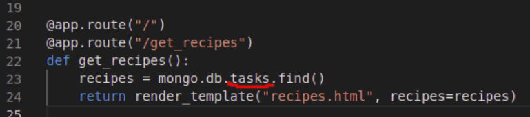
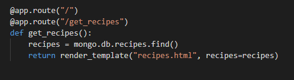
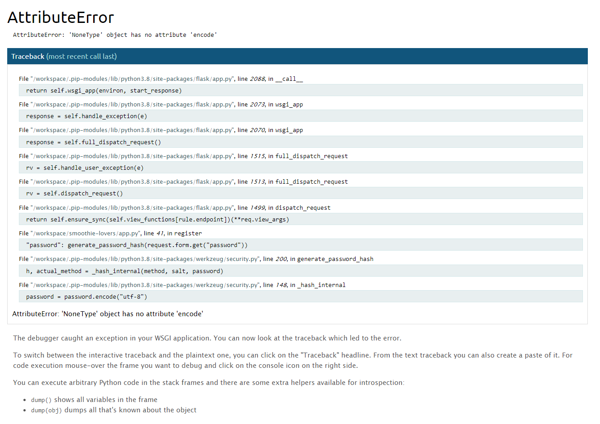
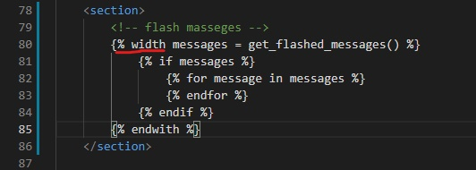
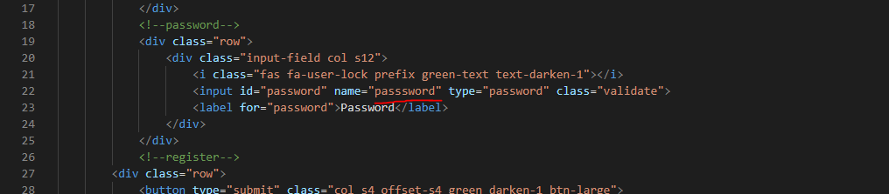

# Testing

- [Encountered Issues](#ecountered-issues)
- [Code Validation](#code-validation)
- [Testing User stories](#testing-user-stories)
- [Testing Functionality](#testing-functionality)
- [Testing Compatibility](#testing-compatibility)
- [Testing Accessibility](#testing-accessibility)
- [Testing Performance](#testing-performance)
- [Further Testing](#further-testing)

## Encountered Issues
---

**Project Bugs And solutions**
---
While working on this project I encountered the following problems which I tried to solve in the following way:
1. BUG: Problem with connecting Flask to MongoDB Atlas, data didnt display in browser as expected but the GET 200 was received. 
In app.py wrong variable targeted instead of recipes the tasks was targeded.
- SOLUTION: Change the name from tasks to recipes

2. ISSUE: While working on adding registration functionality on Register form the` Attribut Error: 'NoneType" object has no attribite 'encode'` was received 
- SOLUTION: Two typos was found `with` typo in base.html form line 80 and `password` typo in register.html line 22

## Code Validation
---

## Testing User stories
---

## Testing Functionality

### Checking for broken links
---

### Responsive Design
---

 **Encountered problems while testing the site on different devices**
 

## Testing Compatibility
---

---
## Testing Performance
---

## Testing Accessibility
----

- **Accessibility for mobile devices on LightHouse**

## Further Testing

### Overflow
