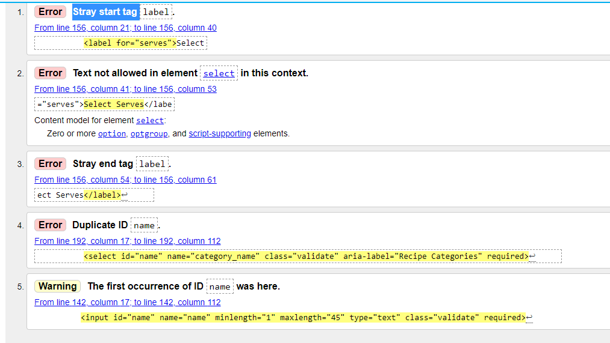

# Testing

- [Encountered Issues](#ecountered-issues)
- [Code Validation](#code-validation)
- [Testing User stories](#testing-user-stories)
- [Testing Functionality](#testing-functionality)
- [Testing Compatibility](#testing-compatibility)
- [Testing Accessibility](#testing-accessibility)
- [Testing Performance](#testing-performance)
- [Further Testing](#further-testing)

## Encountered Issues
---

**Project Bugs And solutions**
---
While working on this project, I encountered a lot of problems, issues and bugs. Unfortunatelly I'm it is not possible to enumerate all of them. One was related to the loss of the entire initial README file and the project on the gitpod at the very beginning of the project , which made me decide to do my commits very often.
Here are the problems which were solved in the following way:
1. **BUG:** Problem with connecting Flask to MongoDB Atlas, data didnt display in browser as expected but the GET 200 was received. 
In app.py wrong variable targeted instead of recipes the tasks was targeded.
- **SOLUTION:** Change the name from tasks to recipes

2. **ISSUE:** While working on adding registration functionality on Register form the` Attribut Error: 'NoneType" object has no attribite 'encode'` was received 
- **SOLUTION:** Two typos was found `with` typo in base.html form line 80 and `password` typo in register.html line 22

3. **ISSUE:**  While binding data to the recipe edit form I encountered a data binding problem with ingredients sections in edit_recipe form.
The data did not want to display at all or all listed ingredients were displayed in each line depense on how many ingredients were listed in the recipe.
- **SOLUTION:** The problem was in looping over `{{ ingredients }}` in `for ingredient in recipe.ingredients` and the value should be `{{ ingredient }}`

4. **ISSUE:**  While binding data to the recipe edit form I encountered a data binding problem with methods sections in edit_recipe form.
The data did not want to display or all.
- **SOLUTION:** The problem was the wrong property in for loop `` should be ``

5. **BUG:** When trying to get a new account for the user, the register form stopped working and an error appeared `Incorrect Username and/or Password`
- **SOLUTION:** The problem was accidentally changed url_for address from `register` to `login`, which was restored to the correct one

 6. **ISSUE** Problem with the same height display of cards with different contents, cards break in the row and move to another making uneven amound in deferent row.
-**SOLUTION:** It took a good while to find the solution and trying different options, finnaly with a big help og tutor support it has been set using flexbox and some other style in the styles.css. The classes names were oryginaly set polish before commit were changed to english.

 7. **BUG** When adding a new recipe to a collection, categories are not displayed as selected, but displayed as `none`

- **SOLUTION:** Change value `name="name"` to `name="category_name""` to match the `name="category_name"` in request method in python app.route

8. **ISSUE** When implementing pagination on the home page the recipes didn't split between the displayed pages. Wrong data was passed from the route function to the page, 
the recipes were iterating through the recipes, not the paginated recipes.

- **SOLUTION:** Replace the wrong data in the `@app.route("/get_recipes")` render_templates `recipes=recipes`and `paginated_recipes=paginated_recipes` to: `recipes=recipes_paginated`

## Code Validation
---

### HTML Validator
1. used [W3C Markup Validation Service HTML](https://validator.w3.org/) to validate my HTML code for all pages.
Because the code is made up of Jinja templates, had to checked on the siteby right clicking each page, selecting View Page Source and running that generated code through the validator.

    **Recipes Page** (`recipes.html`) - home page
    - ERROR 1: Element `<h3>` not allowed as child of element span in this contest for all recipes
        - FIXED - class="title-font" removed from `<h3>` and moved to ``
    
     

    - ERROR 2: Attribute `minlenght` not allowed on element input at this point
        - FIXED - Attribute `minlenght` removed
        
    

    - ERROR 3: Element `<h3>` not allowed as child of span in this context
        - FIXED - the solution found on the 
        [stack overflow](https://stackoverflow.com/questions/18960581/element-h5-not-allowed-as-child-of-element-span-in-this-context) `` replaced by `
`
      
    

    - ERROR 4: End tag `<section>` seen, but were open elements and Unclosed element `
`
        - FIXED - Move `
` just before `</section>`
    
    

     **Recipe Page** (`recipe.html`)
     - WARNING: Section lacks heading
        - FIXED - `` for flash massages in base.html replaced by `
`
      
   
    **Register Page** (`register.html`)
    - WARNING: Section lacks heading
        - FIXED - `` for flash massages in base.html replaced by `
`

    **Add Recipe Page** (`add_recipe.html`) and **Edit Recipe** (`edit_recipe.html`) the same errors and warning

    - 
        - FIX ERRORS 1,2,3 move `<label>` element outside the `<select>` element 
     
        - FIX ERRORS 4,5 Duplicate ID and the first occurence of ID for two the same `name` id's for categories and recipes collection, changed in to `category_name`
    

    **Edit Recipe Page** (`edit_recipe.html`)  additional error
    - ERROR option element must have either an empty value attribute or no text content
    - FIXED by adding to `<select>` element attribute `size="6"`
     

    **Profile Page** (`profile.html`)

    - ERRORS: Element `<h3>` not allowed as child of element `` in this context
        - FIXED - `<class="title-font>` removed from heading and 

      
    - WARNINGS: Element `<h3>` not allowed as child of element '` in this context
     - FIXED - '` replaced by '
`
     

    **Login Page** (`login.html`) 0 Errors & 0 Warnings

    **Page Manage Categories** (`categories.html`):  0 Errors & 0 Warnings

    **403 Page** (`403.html`) : 0 Errors & 0 Warnings

    **404 Page** (`404.htlm`) 0 Errors & 0 Warnings

    **500 Page** (`500.html`) 0 Errors & 0 Warnings

    **Contact Page** (`contact.html`) 0 Errors & 0 Warnings

    **Utensils Page** (`utensils.html`) 0 Errors & 0 Warnings

    **Add Category Page** (`add_category.html`) 0 Errors & 0 Warnings

    **Edit Category Page** (`edit_category.html`) 0 Errors & 0 Warnings

### CSS Jigsaw Validator
2. used [jigsaw W3C CSS Validation Service](https://jigsaw.w3.org/css-validator//) to validate my CSS code, came out clean with no errors with 53 warnings about vendor extension

    - **WARNINGS** 53 warnings related to unknown vendor extension i found that is also non-issue after reading about it on different sources [Stack Overflow](https://stackoverflow.com/questions/52490004/what-are-all-of-these-w3c-css-validation-warnings-about)

 

    - CSS code was passed through Auto Prefixer to add vendor prefixes [Auto Prefixer](https://autoprefixer.github.io/)

### script.js testing
3. used [jshint](https://jshint.com/) to validate javascript code for script.js
In the file script.js static analysis tool: jshint did not show any errors except:
- 6 warnings, and
- 2 undefined variables: "$" and "M" in line 13 and 
- one unused variable `goBack`

        - **WARNINGS** >> let is available in ES6 (use 'esversion: 6') or Mozilla JS extensions (use moz). 
        - **SOLUTION** >> I found the solution on the [stackoverflow](https://stackoverflow.com/questions/27441803/why-does-jshint-throw-a-warning-if-i-am-using-const)
        that a comment `/*jshint esversion: 6 */` should be added at the beginning of each java script file which worked.

    

### Python PEPP
4. used online [PEP8](http://pep8online.com/) 
The entire cod was placed in the PEP8 tool and passed the test successfully

## Testing User stories
---
## New User Stories
1. As a  new visitor, I want to navigate the site easily, so that I can find what I need effectively.
User is able to browse through allthe recipe car

## Testing Functionality

### Checking for broken links
---

### Responsive Design
---

 **Encountered problems while testing the site on different devices**
 

## Testing CompatibilityFix
---

---
## Testing Performance
---

## Testing Accessibility
----

- **Accessibility for mobile devices on LightHouse**
**Recipes Page** (`recipes.html`) - HOME PAGE
    - DESKTOP
    - MOBILE

**Recipe Page** (`recipe.html`)
    - DESKTOP
    - MOBILE
  
**Register Page** (`register.html`)
    - DESKTOP
    - MOBILE

**Add Recipe Page** (`add_recipe.html`)#
    - DESKTOP
    - MOBILE

**Edit Recipe** (`edit_recipe.html`)
    - DESKTOP
    - MOBILE

**Profile Page** (`profile.html`)
    - DESKTOP
    - MOBILE

**Login Page** (`login.html`)
    - DESKTOP
    - MOBILE

**Page Manage Categories** (`categories.html`)
- DESKTOP
    - MOBILE

**Contact Page**
    - DESKTOP
    - MOBILE 

 **Utensils Page**
    - DESKTOP
    - MOBILE

 **Add Category Page** 
    - DESKTOP
    - MOBILE

**Edit Category Page** 
    - DESKTOP
    - MOBILE

## Further Testing

### Overflow
