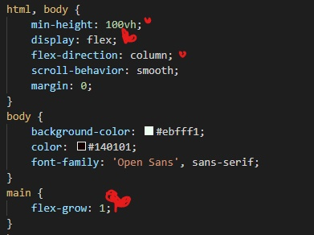
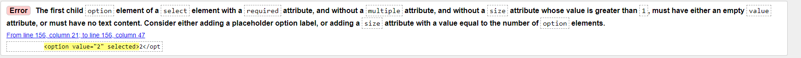
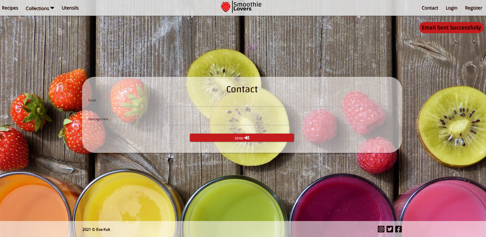
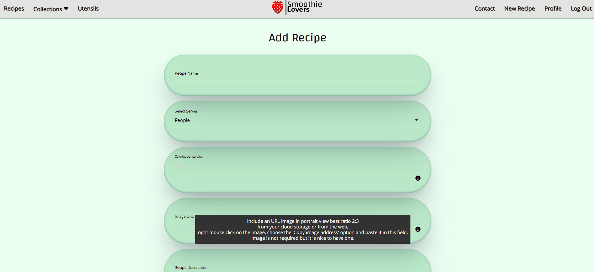
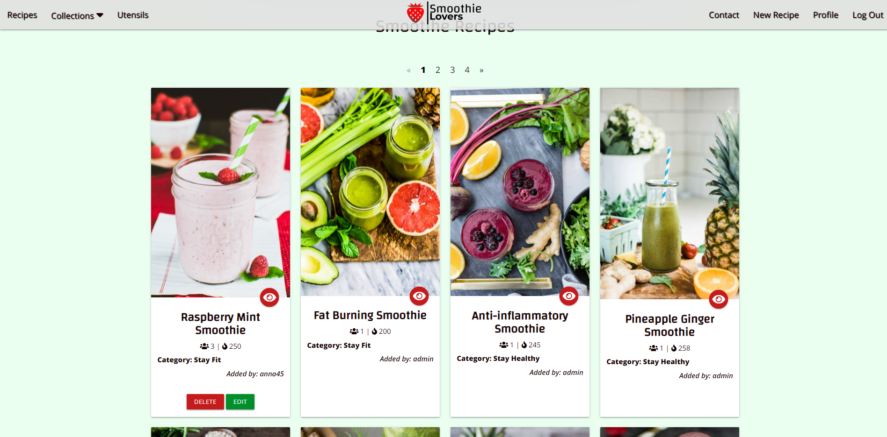
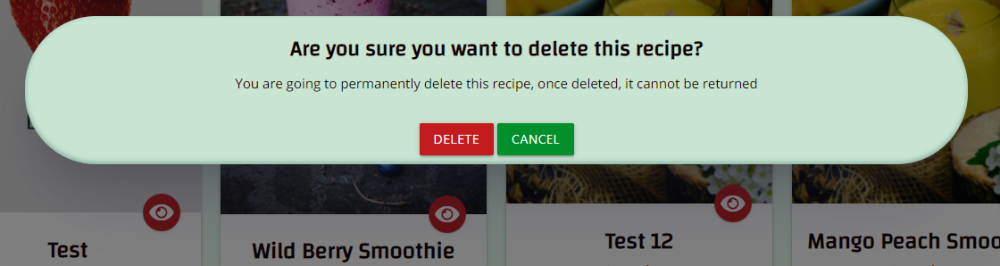
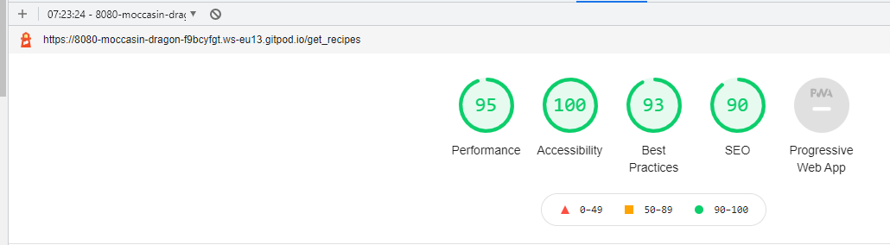
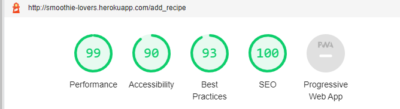
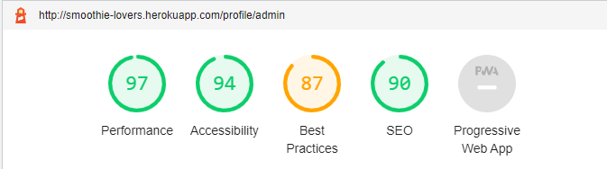

# Testing

- [Encountered Issues](#ecountered-issues)
- [Code Validation](#code-validation)
- [Testing User Stories](#testing-user-stories)
- [Testing Functionality](#testing-functionality)
- [Testing Compatibility](#testing-compatibility)
- [Testing Accessibility](#testing-accessibility)
- [Testing Performance](#testing-performance)
- [Further Testing](#further-testing)

## Encountered Issues
---

**Project Bugs and Solutions**
---
While working on this project, I encountered a lot of problems, issues and bugs. One was related to the loss of the entire initial README file ready for my first mentor session. I also had troubles a few times when my workspace crashed, so that I had to open my project again from github, which made me decide to do my commits more often.
Here are some of the problems which were solved in the following way:
1. **BUG:** Problem with connecting Flask to MongoDB Atlas, data didn't display in browser as expected but the GET 200 was received. 
In app.py wrong variable targeted instead of recipes the tasks was targeted.
- **SOLUTION:** Change the name from tasks to recipes.

2. **ISSUE:** While working on adding registration functionality on Register form the` Attribute Error: 'NoneType" object has no attribute 'encode'` was received. 
- **SOLUTION:** Two typos were found `with` typo in base.html form line 80 and `password` typo in register.html line 22.

3. **ISSUE:**  While binding data to the recipe edit form I encountered a data binding problem with the ingredients section in the edit_recipe form.
The data did not want to display at all or all listed ingredients were displayed in each line, no matter how many ingredients were listed in the recipe.
- **SOLUTION:** The problem was in looping over `{{ ingredients }}` in `for ingredient in recipe.ingredients` and the value should be `{{ ingredient }}`

4. **ISSUE:**  While binding data to the recipe edit form I encountered a data binding problem with methods sections in edit_recipe form.
The data did not want to display at all.
- **SOLUTION:** The problem was the wrong property in for loop `` which should be ``

5. **BUG:** When trying to get a new account for the user, the register form stopped working and an error appeared `Incorrect Username and/or Password`
- **SOLUTION:** The problem was accidentally changing the url_for address from `register` to `login`, which was restored to the correct one.

 6. **ISSUE:** Problem with the same height display of cards with different contents, cards break in the row and move to another making uneven amounts in deferent rows.
- **SOLUTION:** It took a good while to find the solution and try to find different options, finally with big help from tutor support it has been set using flexbox and some other style in the styles.css. The class names were originally set to polish before commits were changed to english.

 7. **BUG** When adding a new recipe to a collection, categories are not displayed as selected, but displayed as `none`

- **SOLUTION:** Change value `name="name"` to `name="category_name""` to match the `name="category_name"` in request method in the Python app.route

8. **ISSUE** When implementing pagination on the home page the recipes didn't split between the displayed pages. Wrong data was passed from the route function to the page, 
the recipes were iterating through the recipes, not the paginated recipes.

- **SOLUTION:** Replace the wrong data in the `@app.route("/get_recipes")` render_templates `recipes=recipes`and `paginated_recipes=paginated_recipes` to: `recipes=recipes_paginated`

9. **ISSUE** Footer doesn't display correctly on Contact, Login, Register and Landscape
**SOLUTION** Set  for section body: `min-height: 100vh` `display:flex;` `flex-direcion:smooth;` , for section main: `flex-grow: 1;`
for landscape `min-height: 175vh;` and `height: 175vh;`

10. **ISSUE** Pylint warning: Possible unbalanced tuple unpacking with sequence
**SOLUTION** Found on [stackoverflow](https://stackoverflow.com/questions/27980121/pylint-warning-possible-unbalanced-tuple-unpacking-with-sequence) by adding to app.route the code of line

11. **ISSUE** Textarea error found in devtool
**SOLUTION** To fix the error I removed the textarea initializatiom from materializecss to initialize textarea for ingredients and methons fields from script.js, the application work with no changes

12. **ISSUE** Images in the cards doesn't display evenly. During the project development stage, I found it difficult to correctly arrange the cards and photos in the recipes. The last change I have made it was to keep the images in the cards the same height, no matter what image the user pass in the recipe, which in the earlier version had to be the similar size to be properly displayed on the site. 

**SOLUTION** In order for the cards to display responsively and correctly on different device sizes, I needed to adjust the width in the media query, which I had to do in a non-standard way. I tested the website in dev tool, online responsinator and responsive designer tool

## Code Validation
---
### HTML Validator
1. Used [W3C Markup Validation Service HTML](https://validator.w3.org/) to validate my HTML code for all pages.
Because the code is made up of Jinja templates, had to check on the site by right clicking each page, selecting View Page Source and running that generated code through the validator.

    **Recipes Page** (`recipes.html`) - home page
    - **ERROR 1:** Element `<h3>` not allowed as child of element span in this contest for all recipes
        - FIXED - class="title-font" removed from `<h3>` and moved to ``
    
     

    - **ERROR 2:** Attribute `minlenght` not allowed on element input at this point
        - FIXED - Attribute `minlenght` removed
        
    

    - **ERROR 3:** Element `<h3>` not allowed as child of span in this context
        - FIXED - the solution found on 
        [stack overflow](https://stackoverflow.com/questions/18960581/element-h5-not-allowed-as-child-of-element-span-in-this-context) `` replaced by `
`
      
    

    - **ERROR 4:** End tag `<section>` seen, but there were open elements and an unclosed element `
`
        - FIXED - Move `
` just before `</section>`

    

    

     **Recipe Page** (`recipe.html`)
     - WARNING: Section lacks heading
        - FIXED - `` for flash messages in base.html replaced by `
`
      
   
    **Register Page** (`register.html`)
    - **WARNING:** Section lacks heading
        - FIXED - `` for flash messages in base.html replaced by `
`

    **Add Recipe Page** (`add_recipe.html`) and **Edit Recipe** (`edit_recipe.html`), where the same errors and warnings appeared

    - 

        - FIX ERRORS 1,2,3 move `<label>` element outside the `<select>` element 

     

        - FIX ERRORS 4 and 5 using Duplicate ID and the first occurence of ID for two of the same `name` id's for categories and recipes collection, changed it to `category_name`

    

    **Edit Recipe Page** (`edit_recipe.html`)  additional error
    - **ERROR** option element must have either an empty value attribute or no text content
    - FIXED by adding to `<select>` element attribute `size="6"`

     

    **Profile Page** (`profile.html`)

    - **ERRORS:** Element `<h3>` not allowed as child of element `` in this context
        - FIXED - `<class="title-font>` removed from heading

      

    -** WARNINGS:** Element `<h3>` not allowed as child of element `` in this context
     - FIXED - '` replaced by '
`
     

    **Login Page** (`login.html`) 0 Errors & 0 Warnings

    **Page Manage Categories** (`categories.html`):  0 Errors & 0 Warnings

    **403 Page** (`403.html`) : 0 Errors & 0 Warnings

    **404 Page** (`404.htlm`) 0 Errors & 0 Warnings

    **500 Page** (`500.html`) 0 Errors & 0 Warnings

    **Contact Page** (`contact.html`) 0 Errors & 0 Warnings

    **Utensils Page** (`utensils.html`) 0 Errors & 0 Warnings

    **Add Category Page** (`add_category.html`) 0 Errors & 0 Warnings

    **Edit Category Page** (`edit_category.html`) 0 Errors & 0 Warnings

### CSS Jigsaw Validator
2. Used [jigsaw W3C CSS Validation Service](https://jigsaw.w3.org/css-validator//) to validate my CSS code, came out clean with no errors with 53 warnings about vendor extension

    - **WARNINGS** 53 warnings related to unknown vendor extension, which I found is also a non-issue after reading about it on different sources [Stack Overflow](https://stackoverflow.com/questions/52490004/what-are-all-of-these-w3c-css-validation-warnings-about)

    

    - CSS code was passed through Auto Prefixer to add vendor prefixes [Auto Prefixer](https://autoprefixer.github.io/)

### script.js testing
3. used [jshint](https://jshint.com/) to validate javascript code for script.js.
In the file script.js static analysis tool: jshint did not show any errors except:
- 6 warnings, and
- 2 undefined variables: "$" and "M" in line 13 and 
- one unused variable `goBack`

    - **WARNINGS** >> let is available in ES6 (use 'esversion: 6') or Mozilla JS extensions (use moz). 
    - **SOLUTION** >> I found the solution on 
    
    [stackoverflow](https://stackoverflow.com/questions/27441803/why-does-jshint-throw-a-warning-if-i-am-using-const)
    that a comment `/*jshint esversion: 6 */` should be added at the beginning of each java script file which worked.

    

### Python PEP8
4. used online [PEP8](http://pep8online.com/).
The entire code was placed in the PEP8 tool and passed the test successfully.

## Testing User stories
---
## New User Stories
1. As a  new visitor, I want to navigate the site easily, so that I can find what I need effectively.
    - No matter what page the user lands on, they can easily find and use the navigation bar which also is set fixed, being available at all times.
    - New users have access to Recipes, Collection of 4 categories, Contact, Login and Register links on the navigation bar.
    - The logo always leads back to the home page.
    

2. As a new visitor, I want to be able to access the website on a desktop and on mobile devices, so that I won't be restricted from which device I can access the site on. 
    - The website is responsive and tested on various devices as well as operating systems.
    - The footer is placed relative to the end of website, so users will be able to see the website, especially on small devices.
    
    

3. As a new visitor, I want to be able to follow or connect with the owner of the website on social media, so that I can see what else they are doing.
    - The footer contains social media links, so that the user can have easy access to their social media accounts.
    

4. As a new visitor, I want to be able to contact the website owner, so that I will be able to share my feedback regarding the website, ask any questions or recommendations that I may have.
    - Website contain Contact page with Contact form connected using Flask and Gmail account where the user is able to send message to the owner of the website. When the user fills in the fields corectly the flash message will display the success message: `Email Sent Successfully` 
    

5. As a new visitor, I want to browse other users recipes on the website without register, so that I can decide if I want to have an account on that website.
    - When the user lands on the website without being logged in, they are able to browse through all the recipe cards available on the website, choose interesting ones and by using a red pulse eye button is able to view the full recipe description. The recipe description contains a `GO BACK ` button which loads to the previous URL opened in history list.
    

    

6. As a new visitor, I want to have Register/Log In functions, so that I can have my own profile where I can keep track of my own recipes.
    - From the navigation bar a new user can go to the Register page where the user can register using a username and password. A confirm password field is set to make sure that the user has choosen their password correctly. If passwords don't match there will be a message displaying `Password doesn't match, try again`.
    There is a message displaying what type of characters and length is required for username and password.

    

    - If the chosen username has been already taken, after the form is submitted the information message will display 'Username already exists, please choose another', and they will be able to choose another name.

    
    
    - After registering, the user will be redirected to their own profile page and have the ability to add, edit and delete their own recipes.

    

    - As the user completes the registration process, they are able to Log In to their profile using the Log In form from the navigation bar to access their profile. When the user will log out, a message will display "You have been logged out". If the user puts the wrong username or password, they will be informed and can try again.

    

7. As a new visitor, I want to be able to filter recipes by ingredient, so that I can find recipes using ingredients I like.
    - on the top of the website on the hero image there is a search box, where the user is able to search recipes by ingredients. 

    

    

    - if there is no recipe with chosen ingredient the message "No Result Found" will pop up and links to `REGISTER` or `LOGIN` will appear on the site.

    

8. As a new / existing user, I want to be able to search recipes by category, so that I can find a recipe according to the category they belong to.
    - on the navigation bar there is a dropdown `Collection` link with initialy 4 different categories `Stay Healty`, `Stay Fit`, `Stay Happy` and `Stay Young` with a little description attached, describing what kind of smoothies users can expect to find there.

    

9. As a new visitor, I want to see if there is any good kitchen tools recommendations, so that I can get some ideas which I might need to make smoothies.
- on the navigation bar there is a `Utensils` link where user can find some owner recommendations of kitchen tools. User is able to see the image of the tool, read a little description by clicking on the eye icon. When hovering the eye icon the tooltip message `About item` will appear. There is a link to the Amazon icon when hovering, the tooltip message `Buy in here` will appear which will redirect the user to the shop website open in the new window where the user can purchase the tool.

10. As a user, I want to easily understand the purpose of this site.
- When the user lands on the website the welcome sign describes the purpose of the website.
- The hero image, placed on the home page gives a first glimpse on the website content and purpose.
- The logo and name of the website indicates what is the website's purpose. 

## Registered User Stories
11. As a registered user, I want to add my own recipes for safe keeping, which I can easily find and share it with others users from the website.
- Once the user is registered, they need to Log In to their profile to be able to add new recipes using link `New Recipe` on the navbar or a button under user's profile sign. Following the instructions, the user is able to fill in the form.

 

12. As a registered user, I want to edit my recipes, so that I can change them as I would like.
- Once the user is Registered and Logged In, they have access to all of their recipes. From there, the user can edit their recipe and use the buttons Edit Recipe or Cancel if they don't want to do any changes. When `Edit recipe` button is chosen the recipe will be updated and user will stay on the same site in case they want to do more changes or use `Go Back` button to come back to the previous website. If user clicks the `Cancel` button, they will be redirected to home page. User can edit recipes directly from the home page.

13. As a registered user, I want to be able to remove my own recipes, so that I can update which recipes I have in my profile.
- Once the user is Registered and Logged In, they have access to all of their recipes from their profile or home page where users will be able to remove their recipe. On each recipe beside the edit button there is a red delete button.

14. As a registered user, I want to get a confirmation message before deleting the recipe, so I won't delete a recipe by mistake.
- There is a confirmation message presented with the modal confirm or cancel buttons informing the user before deleting a recipe.

## Admin / Owner User Stories
15. As an admin user, I want to be able to add/edit/remove categories, so that I can adapt to the changing needs of the website users.
    - The Admin is able to Log In to their account and add/edit/delete recipes like every other user does.
    - Only Admin is able to add/edit/delete categories. 
    - The Manage Categories button is placed on the the admin's Profile site and an Admin can have access after Logging In

    

    - On the Manage Categories page Admin has access to all existing categories. There is an `Add Category` Button where an Admin can add a new category.

    
    
    - Once `Add Category `button was chosen an Admin is able to add a category following the instructions on the form
    and press the `Add Category` button. There will be a message informing an Admin about the "New Category Added".

    

    - Admins can Edit existing Categories by choosing the `Edit` Button and then confirm by using `Edit Category` or if they don't want to make any changes choose the `Cancel` button. Once the page is uploaded the user will be redirected to the Categories Page. Both buttons redirect an Admin to Manage Categories page. 
    - Admins can remove existing categories by choosing the `Delete` button placed beside the `Edit` button.
    - There is a confirmation message presented with the modal confirm or cancel buttons informing the admin before deleting a category.

    

    - Once a recipe is deleted a message will appear "Category Deleted Successfully".

    

## Site Owner Stories
16. As a site owner, I want to be able to promote kitchen tools, so that the users can choose for themselves the best option on the market.
    - There is a link placed on the navbar which leads to the `Utensils` page where users can find and buy kitchen tools recommended by the owner.
    - Page contains 

    

## Testing Functionality
Manually Testing Functionality

### base.html
| Element                              | Action | Expected Result                      | PASS/FAIL | PROBLEM                                                      | FIX                                                          |
| ------------------------------------ | ------ | ------------------------------------ | :-------: | ------------------------------------------------------------ | ------------------------------------------------------------ |
| **Navbar**                           |        |                                      |           |                                                              |                                                              |
| Logo "Smoothie Lovers"               | Click  | Redirect to home page (Recipes Page) | **PASS**  |                                                              |                                                              |
| Recipes Link (Home Page)             | Click  | Redirect to all Recipes              | **PASS**  |                                                              |                                                              |
| Collections Dropdown link            | Click  | Open Collections dropdown            | **PASS**  | Dropdown list doesn't work on Contact, Login, Register, Utensils pages | add to each app.route  categories = list(mongo.db.categories.find()) categories=categories  |
| Collection page link with categories | Click  | Redirect to Categories pages         | **PASS**  |                                                              |                                                              |
| Utensils Link                        | Click  | Redirect to Utensils page            | **FAIL**  | Dropdown doesn't work on mobile devices                       | add list to categories variable `categories = mongo.db.categories.find()` after`categories = list(mongo.db.categories.find())` |
| Contact  Link                        | Click  | Redirect to Contact page             | **PASS**  |                                                              |                                                              |
| New Recipe Link                      | Click  | Redirect to Add Recipe page          | **PASS**  |                                                              |                                                              |
|                                      |        | (Only visible if user in session)    | **PASS**  |                                                              |                                                              |
| Register Link                        | Click  | Redirect to Register page            | **PASS**  |                                                              |                                                              |
|                                      |        | (Not visible if user in session)     | **PASS**  |                                                              |                                                              |
| Log In Link                          | Click  | Redirect to Log In page              | **PASS**  |                                                              |                                                              |
|                                      |        | (Not visible if user in session)     | **PASS**  |                                                              |                                                              |
| Log Out Link                         | Click  | Log Out user out of Profile          | **PASS**  |                                                              |                                                              |
|                                      |        | (Only when user is logged in)        | **PASS**  |                                                              |                                                              |
|                                      | Click  | Redirect to Log In page              | **PASS**  |                                                              |                                                              |
|                                      |        | (Only visible if user in session)    | **PASS**  |                                                              |                                                              |
| Profile Link                         | Click  | Redirect to Profile page             | **PASS**  |                                                              |                                                              |
|                                      |        | (Only visible if user in session)    | **PASS**  |                                                              |                                                              |
|                                      |        |                                      |           |                                                              |                                                              |
| **SideNav**                          |        |                                      |           |                                                              |                                                              |
| Hamburger Icon                       | Click  | Open Sidenav                         | **PASS**  |                                                              |                                                              |
| Recipes Link (Home Page)             | Click  | Redirect to home page (Recipes Page) | **PASS**  |                                                              |                                                              |
| Collections Dropdown                 | Click  | Open Collections dropdown            | **PASS**  |                                                              |                                                              |
| Collection page link with categories | Click  | Redirect to Categories pages         | **PASS**  |                                                              |                                                              |
| Utensils                             | Click  | Redirect to Utensils page            | **PASS**  |                                                              |                                                              |
| Manage Categories Link               | Click  | Redirect to Manage Categories page   | **PASS**  |                                                              |                                                              |
|                                      |        | (Only visible if admin in session)   | **PASS**  |                                                              |                                                              |
| Contact                              | Click  | Redirect to Contact page             | **PASS**  |                                                              |                                                              |
| New Recipe Link                      | Click  | Redirect to Add Recipe page          | **PASS**  |                                                              |                                                              |
|                                      |        | (Only visible if user in session)    | **PASS**  |                                                              |                                                              |
| Profile                              |        | Redirect to Profile page             | **PASS**  |                                                              |                                                              |
|                                      |        | (Only visible if user in session)    | **PASS**  |                                                              |                                                              |
| Register Link                        | Click  | Redirect to register page            | **PASS**  |                                                              |                                                              |
|                                      |        | (Not visible if user in session)     | **PASS**  |                                                              |                                                              |
| Log In Link                          | Click  | Redirect to log in page              | **PASS**  |                                                              |                                                              |
|                                      |        | (Not visible if user in session)     | **PASS**  |                                                              |                                                              |
| Log Out Link                         | Click  | Log user out of account              | **PASS**  |                                                              |                                                              |
|                                      | Click  | Redirect to log in page              | **PASS**  |                                                              |                                                              |
|                                      |        | (Only visible if user in session)    | **PASS**  |                                                              |                                                              |
| **Footer**                           |        |                                      |           |                                                              |                                                              |
| Instagram Link                       | Click  | Open on external page                | **PASS**  |                                                              |                                                              |
| Twitter Link                         | Click  | Open on external page                | **PASS**  |                                                              |                                                              |
| Facebook Link                        | Click  | Open on external page                | **PASS**  |                                                              |                                                              |
----
----

### recipes.html / Home 

| Element                              | Action     | Expected Result                          | PASS/FAIL | PROBLEM | FIX  |
| ------------------------------------ | ---------- | ---------------------------------------- | :-------: | ------- | ---- |
| **Recipes/Home Page**                |            |                                          |           |         |      |
| **Search box**                       |            |                                          |           |         |      |
| Text Input                           | Text input | Text displayed to user                   | **PASS**  |         |      |
| Reset Button                         | Click      | Clear searches, show home page (Recipes) | **PASS**  |         |      |
| Search Button (with result)          | Click      | Display matched results                  | **PASS**  |         |      |
| Search Button (empty)                | Click      | "Please fill in the field" message       | **PASS**  |         |      |
| Search Button (no result)            | Click      | "No Result Found" message                | **PASS**  |         |      |
| **'No Results Found' links**         |            |                                          |           |         |      |
| Register link                        | Click      | Redirect to Register Page                | **PASS**  |         |      |
| Log In link                          | Click      | Redirect to Log In Page                  | **PASS**  |         |      |
| **Recipe Card**                      |            |                                          |           |         |      |
| Full Recipe Red Pulsating Eye button | Click      | Redirect to full recipe                  | **PASS**  |         |      |
| Edit recipe button                   | Click      | Redirect to edit recipe page             | **PASS**  |         |      |
|                                      |            | (Only visible if user in session)        | **PASS**  |         |      |
| Delete recipe button                 | Click      | Open delete confirmation modal           | **PASS**  |         |      |
|                                      |            | (Only visible if user in session)        | **PASS**  |         |      |
| Delete modal                         | Click      | Delete selected recipe                   | **PASS**  |         |      |
|                                      |            | (Only visible if user in session)        | **PASS**  |         |      |
|                                      |            | Redirect to Profile page                 | **PASS**  |         |      |
|                                      |            | 'Recipe deleted' confirmation message    | **PASS**  |         |      |
| Delete modal - cancel button         | Click      | Close modal with no change made          | **PASS**  |         |      |
| **Pagination**                       |            |                                          |           |         |      |
| << btn                               | Click      | Reveal 'previous' recipes                | **PASS**  |         |      |
| Pagination number                    | Click      | Specific recipes page number             | **PASS**  |         |      |
| \>> btn                              | Click      | Reveal 'next' recipes                    | **PASS**  |         |      |
|                                      |            |                                          |           |         |      |
----
----

# recipe.html
| Element                      | Action                   | Expected Result                                              | PASS/FAIL | PROBLEM | FIX  |
| ---------------------------- | ------------------------ | ------------------------------------------------------------ | :-------: | ------- | ---- |
| **Single Recipe **           |                          |                                                              |           |         |      |
| Back to Recipes/home button  | Click                    | Redirect to previous page in the history (Recipes or Profile) | **PASS**  |         |      |
| Recipe image                 | displayed on n page open | Recipe image displayed properly                              | **PASS**  |         |      |
| Recipe Category              | displayed on n page open | Recipe Category displayed properly                           | **PASS**  |         |      |
| Recipe Serves & Calories     | displayed on n page open | Recipe Serves & Calories displayed properly                  | **PASS**  |         |      |
| Recipe *Added by:*           | displayed on n page open | Recipe Added by: displayed properly                          | **PASS**  |         |      |
| Recipe ingredients list      | displayed on n page open | Recipe ingredients list displayed properly                   | **PASS**  |         |      |
| Recipe method list           | displayed on n page open | Recipe method list displayed properly                        | **PASS**  |         |      |
| Edit recipe button           | Click                    | Redirect to edit recipe page                                 | **PASS**  |         |      |
|                              |                          | (Only visible if user in session)                            | **PASS**  |         |      |
| Delete recipe button         | Click                    | Open delete confirmation modal                               | **PASS**  |         |      |
|                              |                          | (Only visible if user in session)                            | **PASS**  |         |      |
| Delete modal                 | Click                    | Delete selected recipe                                       | **PASS**  |         |      |
|                              |                          | (Only visible if user in session)                            | **PASS**  |         |      |
|                              |                          | Redirect to Profile page                                     | **PASS**  |         |      |
|                              |                          | 'Recipe deleted' confirmation message                        | **PASS**  |         |      |
| Delete modal - cancel button | Click                    | Close modal with no change made                              | **PASS**  |         |      |
|                              |                          |                                                              |           |         |      |
----
----

### add_recipe.html
| Element                                              | Action      | Expected Result                                   | PASS/FAIL | PROBLEM | FIX  |
| ---------------------------------------------------- | ----------- | ------------------------------------------------- | :-------: | ------- | ---- |
| **New Recipe / Add Recipe Form**                     |             |                                                   |           |         |      |
| Choose Select /Category dropdown                     | Click       | Reveal Select/Category options                    | **PASS**  |         |      |
| Text input fields                                    | Type text   | Text appears, line highlights green               | **PASS**  |         |      |
| Text input fields                                    | Leave blank | Line highlights red                               | **PASS**  |         |      |
| Tooltips                                             | Hover/click | Reveal notes/instructions                         | **PASS**  |         |      |
| Image URL                                            |             | Default image uploaded if not added not required  |  **N/A**  |         |      |
| Add ingredient button (+)                            | Click       | Generate new input ingredient field               | **PASS**  |         |      |
| Delete ingredient button (-)                         | Click       | Delete  input ingredient field                    | **PASS**  |         |      |
| Add method step button (+)                           | Click       | Generate new method step field                    | **PASS**  |         |      |
| Delete method step button  (-)                       | Click       | Delete  method step field                         | **PASS**  |         |      |
| Add recipe button(all fields correct)                | Click       | Recipe uploads to database                        | **PASS**  |         |      |
|                                                      |             | Redirect to Profile Page                          | **PASS**  |         |      |
|                                                      |             | "Recipe Added Successfully!" confirmation message | **PASS**  |         |      |
| Add Recipe button (in case if some incorrect fields) | Click       | Page scrolls to incorrect fields                  | **PASS**  |         |      |
| Cancel Button                                        | Click       | Redirect to Recipes/Home page                     | **PASS**  |         |      |

----
----

# edit_recipe.html
| Element                                          | Action       | Expected Result                                     | PASS/FAIL | PROBLEM | FIX  |
| ------------------------------------------------ | ------------ | --------------------------------------------------- | :-------: | ------- | ---- |
| **Edit Recipe Form**                             |              |                                                     |           |         |      |
| All fields                                       | On page open | Pre-populated fields with your previous input       | **PASS**  |         |      |
| Choose Select /Category dropdown                 | Click        | Reveal Select/Category options                      | **PASS**  |         |      |
| Text input fields                                | Type text    | Text appears, line highlights green                 | **PASS**  |         |      |
| Text input fields                                | Leave blank  | Line highlights red                                 | **PASS**  |         |      |
| Tooltips                                         | Hover/click  | Reveal notes/instructions                           | **PASS**  |         |      |
| Image URL                                        |              | not required                                        |  **N/A**  |         |      |
| Add ingredient button (+)                        | Click        | Generate new input  ingredient field                | **PASS**  |         |      |
| Delete ingredient button (-)                     | Click        | Delete  input ingredient field                      | **PASS**  |         |      |
| Add method step button (+)                       | Click        | Generate new method step field                      | **PASS**  |         |      |
| Delete method step button  (-)                   | Click        | Delete  method step field                           | **PASS**  |         |      |
| Update button(all fields correct)                | Click        | Recipe updates on database                          | **PASS**  |         |      |
|                                                  |              | Redirect to Profile Page                            | **PASS**  |         |      |
|                                                  |              | "Recipe Updated Successfully!" confirmation message | **PASS**  |         |      |
| Update button (in case if some incorrect fields) | Click        | Page scrolls to incorrect fields                    | **PASS**  |         |      |
| Cancel  Button                                   | Click        | No changes made to recipe                           | **PASS**  |         |      |
|                                                  |              | Redirect to Recipes/home page                       | **PASS**  |         |      |
----
----

# profile.html
| Element                              | Action | Expected Result                                 | PASS/FAIL | PROBLEM | FIX  |
| ------------------------------------ | ------ | ----------------------------------------------- | :-------: | ------- | ---- |
| **Profile**                          |        |                                                 |           |         |      |
| New Recipe  button                   | Click  | Redirect to Add Recipe page                     | **PASS**  |         |      |
| Manage Categories Button             | Click  | Redirect to Manage Categories page              | **PASS**  |         |      |
|                                      |        | (Only visible if admin in session)              | **PASS**  |         |      |
| **Recipe Card**                      |        |                                                 |           |         |      |
| Full Recipe Red Pulsating Eye button | Click  | Redirect to full recipe                         | **PASS**  |         |      |
| Edit recipe button                   |        | Redirect to edit recipe page                    | **PASS**  |         |      |
|                                      |        | (Only visible if user in session)               | **PASS**  |         |      |
| Delete recipe button                 | Click  | Open delete confirmation modal                  | **PASS**  |         |      |
|                                      |        | (Only visible if user in session)               | **PASS**  |         |      |
| Delete modal                         | Click  | Delete selected recipe                          | **PASS**  |         |      |
|                                      |        | Redirect to recipes/home page                   | **PASS**  |         |      |
|                                      |        | 'Recipe deleted' confirmation message           | **PASS**  |         |      |
| Delete modal - cancel button         | Click  | Close modal with no change made                 | **PASS**  |         |      |
| **Pagination**                       |        |                                                 |           |         |      |
| << btn                               | Click  | Reveal 'previous' recipes                       | **PASS**  |         |      |
| Pagination number                    | Click  | Specific recipes page number                    | **PASS**  |         |      |
| \>> btn                              | Click  | Reveal 'next' recipes                           | **PASS**  |         |      |
| **Inline Links**                     |        |                                                 |           |         |      |
| Log Out link                         | Click  | Redirect to Login Page                          | **PASS**  |         |      |
|                                      |        | "You have beed logged out" confirmation message | **PASS**  |         |      |
----
----
# Collection Pages in the Categories all have the same functionality
| Element                              | Action       | Expected Result                          | PASS/FAIL | PROBLEM | FIX  |
| ------------------------------------ | ------------ | ---------------------------------------- | :-------: | ------- | ---- |
| **Collection in the Category**       |              |                                          |           |         |      |
| **Search box**                       |              |                                          |           |         |      |
| Text Input                           | Text input   | Text displayed to user                   | **PASS**  |         |      |
| Reset Button                         | Click        | Clear searches, show home page (Recipes) | **PASS**  |         |      |
| Search Button (with result)          | Click        | Display matched results                  | **PASS**  |         |      |
| Search Button (empty)                | Click        | "Please fill in the field" message       | **PASS**  |         |      |
| Search Button (no result)            | Click        | "No Result Found" message                | **PASS**  |         |      |
| **'No Results Found' links**         |              |                                          |           |         |      |
| Register link                        | Click        | Redirect to Register Page                | **PASS**  |         |      |
| Log In link                          | Click        | Redirect to Log In Page                  | **PASS**  |         |      |
| Recipe Card                          | On page load | Only display recipes in that category    | **PASS**  |         |      |
| Full Recipe Red Pulsating Eye button | Click        | Redirect to full recipe                  | **PASS**  |         |      |
| Edit recipe button                   | Click        | Redirect to edit recipe page             | **PASS**  |         |      |
|                                      |              | (Only visible if user in session)        | **PASS**  |         |      |
| Delete recipe button                 | Click        | Open delete confirmation modal           | **PASS**  |         |      |
|                                      |              | (Only visible if user in session)        | **PASS**  |         |      |
| Delete modal                         | Click        | Delete selected recipe                   | **PASS**  |         |      |
|                                      |              | (Only visible if user in session)        | **PASS**  |         |      |
|                                      |              | Redirect to Profile page                 | **PASS**  |         |      |
|                                      |              | 'Recipe deleted' confirmation message    | **PASS**  |         |      |
| Delete modal - cancel button         | Click        | Close modal with no change made          | **PASS**  |         |      |
| **Pagination**                       |              |                                          |           |         |      |
| << btn                               | Click        | Reveal 'previous' recipes                | **PASS**  |         |      |
| Pagination number                    | Click        | Specific recipes page number             | **PASS**  |         |      |
| \>> btn                              | Click        | Reveal 'next' recipes                    | **PASS**  |         |      |
| **If nothing in collection**         |              |                                          |           |         |      |
| User message                         | On page load | "No Result Found" message                | **PASS**  |         |      |
| **'No Results Found' links**         |              |                                          |           |         |      |
| Register link                        | Click        | Redirect to Register Page                | **PASS**  |         |      |
| Log In link                          | Click        | Redirect to Log In Page                  | **PASS**  |         |      |
----
----
# categories.html
| Element                      | Action       | Expected Result                                      | PASS/FAIL | PROBLEM | FIX  |
| ---------------------------- | ------------ | ---------------------------------------------------- | :-------: | ------- | ---- |
| **Manage Categories Page**   |              | (Only visible if admin in session)                   |           |         |      |
| Add Category Button          | Click        | Redirect to Add Category page                        | **PASS**  |         |      |
| **CategoryCard**             |              |                                                      |           |         |      |
| Category description         | On page open | Description category displayed properly              | **PASS**  |         |      |
| Edit category button         | Click        | Redirect to edit category page                       | **PASS**  |         |      |
|                              |              | (Only visible if admin in session)                   | **PASS**  |         |      |
| Delete category button       | Click        | Open delete confirmation modal                       | **PASS**  |         |      |
|                              |              | (Only visible if admin in session)                   | **PASS**  |         |      |
| Delete modal                 | Click        | Delete selected recipe                               | **PASS**  |         |      |
|                              |              | (Only visible if admin in session)                   | **PASS**  |         |      |
|                              |              | Redirect to Manage Categories page                   | **PASS**  |         |      |
|                              |              | 'Category deleted Successfully' confirmation message | **PASS**  |         |      |
| Delete modal - cancel button | Click        | Close modal with no change made                      | **PASS**  |         |      |
|                              |              |                                                      |           |         |      |
----
----

# add_categories.html
| Element                                    | Action      | Expected Result                            | PASS/FAIL | PROBLEM | FIX  |
| ------------------------------------------ | ----------- | ------------------------------------------ | :-------: | ------- | ---- |
| **Add Categories Page**                    |             | (Only visible if admin in session)         |           |         |      |
| **CategoryCard**                           |             |                                            |           |         |      |
| Text input fields                          | Type into   | Text appears, line highlights green        | **PASS**  |         |      |
| Text input fields                          | Leave blank | Line highlights red                        | **PASS**  |         |      |
| Add Category Button (all field correct)    | Click       | Category uploads to database               | **PASS**  |         |      |
|                                            |             | Redirect to Manage Categories page         | **PASS**  |         |      |
|                                            |             | "New Category Added!" confirmation message | **PASS**  |         |      |
| Add Category Button (some field incorrect) | Click       | Page scrolls to incorrect fields are red   | **PASS**  |         |      |
|                                            |             |                                            |           |         |      |

----
----

# edit_categories
| Element                                    | Action      | Expected Result                                      | PASS/FAIL | PROBLEM | FIX  |
| ------------------------------------------ | ----------- | ---------------------------------------------------- | :-------: | ------- | ---- |
| **Add Categories Page**                    |             | (Only visible if admin in session)                   |           |         |      |
| **CategoryCard**                           |             |                                                      |           |         |      |
| All input fields                           | Type into   | Pre-populated with previous inputs                   | **PASS**  |         |      |
| Category name input fields                 | On click    | User unable to edit                                  | **PASS**  |         |      |
| Category description input fields          | On click    | User unable to edit                                  | **PASS**  |         |      |
| Text input fields                          | Leave blank | Line highlights red                                  | **PASS**  |         |      |
| ext input fields                           | Type into   | Text appears, line highlights green                  | **PASS**  |         |      |
| Cancel Button                              | Click       | No changes made to collection                        | **PASS**  |         |      |
|                                            |             | Redirect to Manage Categories page                   | **PASS**  |         |      |
| Edit Category Button (all field correct)   | Click       | Category updates to database                         | **PASS**  |         |      |
|                                            |             | Redirect to Manage Categories page                   | **PASS**  |         |      |
|                                            |             | "Category Updated Successfully" confirmation message | **PASS**  |         |      |
| Add Category Button (some field incorrect) | Click       | Page scrolls to incorrect fields are red             | **PASS**  |         |      |
|                                            |             |                                                      |           |         |      |

----
----

# register.html
| Element                          | Action     | Expected Result                                        | PASS/FAIL |
| -------------------------------- | ---------- | ------------------------------------------------------ | :-------: |
| **Register form**                |            |                                                        |           |
| Username                         | Text input | Text displayed to user                                 | **PASS**  |
| Password                         | Text input | Password hidden to user                                | **PASS**  |
| Confirmation Password            | Text input | Password hidden to user                                | **PASS**  |
| Register Button (fields correct) | Click      | Redirect to Profile page                               | **PASS**  |
|                                  |            | New user added to database                             | **PASS**  |
|                                  |            | Redirect to Profile page                               | **PASS**  |
|                                  |            | "Welcome, "username"" confirmation message             | **PASS**  |
| Log In Button (fields incorrect) | Click      | Fields highlighted red, user prompted to change format | **PASS**  |
| Passwords doesn't match          | Click      | "Password doesn't match try again" rejection message   | **PASS**  |
| Username already in use          | Click      | "Username already exists, please choose another"       | **PASS**  |
| **Redirect Link**                |            |                                                        | **PASS**  |
| 'Log In here' link               | Click      | Redirect to Log In page                                | **PASS**  |
|                                  |            |                                                        |           |
|                                  |            |                                                        |           |
----
----

# login.html
| Element                          | Action     | Expected Result                            | PASS/FAIL | PROBLEM | FIX  |
| -------------------------------- | ---------- | ------------------------------------------ | :-------: | ------- | ---- |
| **Login form**                   |            |                                            |           |         |      |
| Username                         | Text input | Text displayed to user                     | **PASS**  |         |      |
| Password                         | Text input | Password hidden to user                    | **PASS**  |         |      |
| Log In Button (fields correct)   | Click      | Redirect to Profile page                   | **PASS**  |         |      |
|                                  |            | "Welcome, "username"" confirmation message | **PASS**  |         |      |
| Log In Button (fields incorrect) | Click      | Reload Log in page                         | **PASS**  |         |      |
| **Redirect Link**                |            |                                            | **PASS**  |         |      |
| 'Register here' link             | Click      | Redirect to Registration page              | **PASS**  |         |      |
|                                  |            |                                            |           |         |      |
|                                  |            |                                            |           |         |      |
----
----

# contact.html
| Element                                 | Action     | Expected Result                                | PASS/FAIL |      |      |
| --------------------------------------- | ---------- | ---------------------------------------------- | :-------: | ---- | ---- |
| **Contact form**                        |            |                                                |           |      |      |
| Email                                   | Text input | Text displayed to user                         | **PASS**  |      |      |
| Message field                           | Text input | Text displayed to the user                     | **PASS**  |      |      |
|                                         |            |                                                | **PASS**  |      |      |
| Send Button (fields correct)            | Click      | Redirect to Contact page                       | **PASS**  |      |      |
|                                         |            | Message sent                                   | **PASS**  |      |      |
|                                         |            | Message received on the owner gmail account    | **PASS**  |    |      |
|                                         |            | Redirect to Profile page                       | **PASS**  |      |      |
|                                         |            | "Email Sent Successfully" confirmation message | **PASS**  |      |      |
| Send Button (fields incorrect or empty) | Click      | "Please Fill in the field" message             | **PASS**  |      |      |
|                                         |            |                                                |           |      |      |
----
----

# utensils.html
| Element                               | Action      | Expected Result                          | PASS/FAIL |
| ------------------------------------- | ----------- | ---------------------------------------- | :-------: |
| **Utensils Page**                     |             |                                          |           |
| **Search box**                        |             |                                          |           |
| Text Input                            | Text input  | Text displayed to user                   | **PASS**  |
| Reset Button                          | Click       | Clear searches, show home page (Recipes) | **PASS**  |
| Search Button (with result)           | Click       | Display matched results                  | **PASS**  |
| Search Button (empty)                 | Click       | "Please fill in the field" message       | **PASS**  |
| Search Button (no result)             | Click       | "No Result Found" message                | **PASS**  |
| **'No Results Found' links**          |             |                                          |           |
| Register link                         | Click       | Redirect to Register Page                | **PASS**  |
| Log In link                           | Click       | Redirect to Log In Page                  | **PASS**  |
| **Utensil Card**                      |             |                                          |           |
| About item description Red Eye button | Click       | Opens item description                   | **PASS**  |
| Close Button (x)                      | Click       | Close item description                   | **PASS**  |
| Amazon Shopping button                | Click       | Open on external page                    | **PASS**  |
| Tooltips Amazon/Eye                   | Hover/click | Reveal notes                             | **PASS**  |
|                                       |             |                                          |           |
----
----

# 403.html, 404.html, 500.html
| Element                                                      | Action                     | Expected Result                                              | PASS/FAIL |                                                   |      |
| ------------------------------------------------------------ | -------------------------- | ------------------------------------------------------------ | :-------: | ------------------------------------------------- | ---- |
| **Defensive programing**                                     |                            |                                                              |           |                                                   |      |
| Go Back Home Button                                          | ClickRedirect to home page |                                                              | **PASS**  |                                                   |      |
| **Not Logged In/user not in session** user:                  |                            |                                                              |           |                                                   |      |
| change end of url addres from `get_recipes` to `add_recipes` |                            | Redirect to page `404 Page Not Found`                        | **PASS**  |                                                   |      |
| change end of url addres from `get_recipes` to `add_recipe`  |                            | Redirect to `Log In` page with the Flash massege `Please log In` | **PASS**  |                                                   |      |
| change end of url addres from `get_recipes` to `edit_recipe` |                            | Redirect to page `404 Page Not Found`                        | **PASS**  |                                                   |      |
|                                                              |                            |                                                              |           |                                                   |      |
| **Logged in / user in session**                              |                            |                                                              |           |                                                   |      |
| change id of different user recipe in the in the `https://8080-moccasin-dragon-f9bcyfgt.ws-eu14.gitpod.io/edit_recipe/.....` URL |                            | Redirect to `403 Forbidden Page`                             | **PASS**  |                                                   |      |
|                                                              |                            | "Access denied. You don't have permission!" denying message  | **PASS**  |                                                   |      |
| change `profile/users` name to `profile/admin` name in url addres |                            | Stays on users profile                                       | **PASS**  |                                                   |      |
| change end of url addres from `add_recipe to `add_category   |                            | Redirect to `403 Forbidden Page`                             | **PASS**  |                                                   |      |
|                                                              |                            | "You have to be an Admin to access this page" denying message | **PASS**  |                                                   |      |
| change end of url addres from `edit_recipe` to `edit_category |                            | Redirect to page `404 Page Not Found`                        | **PASS**  |                                                   |      |
| change end of url addres from `edit_recipe` to `get_categories` |                            | Redirect to `403 Forbidden Page`                             | **PASS**  |                                                   |      |
|                                                              |                            | "You have to be an Admin to access this page" denying message | **PASS**  |                                                   |      |
| **Logged in / admin in session**                             |                            |                                                              |           |                                                   |      |
| change id of different user recipe in the in the `https://8080-moccasin-dragon-f9bcyfgt.ws-eu14.gitpod.io/edit_recipe/.....` URL |                            | Admin takes over the recipe and became his owner, has access to edit and delete recipe | **PASS**  | Only used in emergency when inappropriate content |      |
| **in app.py set `debug=False`**                              |                            |                                                              |           |                                                   |      |
| Set incorect url address for  `https://smoothie-lovers.herokuapp.com/get_recipes` |                            | Redirect to `404 Page Not Found                            | **PASS**  |                                                   |      |
----
----

### Responsive Design
---
- The website has been tested by using [Chrome DevTools](https://developers.google.com/web/tools/chrome-devtools) 
  and also on [Am I Responsive](http://ami.responsivedesign.is/) and [Responsinator](http://www.responsinator.com/) 
  on a number of devices with varying screen dimensions, for both portrait and landscape views, including iPhone 5/SE,
  iPhone 6/7/8, iPhone 6/7/8 plus, iPhone 11, iPad, iPad Pro, Moto G4, Galaxy S5, Surface Duo,
  Galaxy Fold, Widescreen Laptop and Desktop PC, iPad landscape  width: 1024px,  iPhone 6-8 Plump landscape 
 width: 736px ,iPhone 6-8 landscape  width: 667px, Android (Pixel 2) landscape  width: 684px, iPhone expensive landscape  width: 734px
      
- The website was also tested on real devices in both portrait and landscape view. The results with other browsers were satisfying:
    - Samung Galaxy S6/S7/S8/S10/S20.
    - Samsung Galaxy Tablet.

 **Encountered problems while testing the site on different devices**
 
 Issue with displaying the Contact, Login and Register forms on Landscape Devices

 **BEFORE**

**AFTER**

## Testing Compatibility Fix
---
The website was tested on the following browsers and operating systems:

- Google Chrome (Windows 10, Android 11).    
- Microsoft Edge (Windows 10).
- Firefox (Windows 10, Linux).
- Opera (Windows 10, Linux).

    `- Test for Opera browser`

    

    `- Test for Firefox browser`

    

    `- Test for Microsoft Edge browser`

    
---
## Testing Performance
---

Performance has been tested using Lighthouse tool of Google Chrome. The results were a little different every time due to device performance and value estimation . The results at the end were satisfying for desktop devices, but performance of mobile devices need to be reviewed and tested again. There were some issues which caused the results like:

    - Links do not have a discernible name
        Solved by adding aria label to "See recipe buttons"
    - Properly size images Serve images that are appropriately-sized to save cellular data and improve load time.
        Solved by: All images have been resized and rescaled in Adobe Photoshop and compressed int a tiny png tool
    - Background and foreground colors do not have a sufficient contrast ratio.
        Solved by adding to buttons style font-weight: 600;
    - Links do not have a discernible name, Link text (and alternate text for images, when used as links)
        Solved by adding aria-label=Open the menu to hamburger menu 
        aria-label="remove ingredient" to minus ingredient button on edit recipe page
    - Heading elements are not in a sequentially-descending order   
        Solved by changing headings in recipe names from `<h3>` to `<h2>`

**Recipes Page** (`recipes.html`) - HOME PAGE

    - DESKTOP

    - MOBILE

**Single Recipe Page** (`recipe.html`)

    - DESKTOP

    - MOBILE

**Register Page** (`register.html`)

    - DESKTOP

    - MOBILE

**Add Recipe Page** (`add_recipe.html`)

    - DESKTOP

    - MOBILE

**Edit Recipe** (`edit_recipe.html`)

    - DESKTOP

    
    - MOBILE

**Profile Page** (`profile.html`)

    - DESKTOP

    - MOBILE

**Login Page** (`login.html`)

    - DESKTOP

    - MOBILE

**Page Manage Categories** (`categories.html`)

    - DESKTOP

    
    - MOBILE

**Contact Page**

    - DESKTOP

    
    - MOBILE 

 **Utensils Page**

    - DESKTOP

    
    - MOBILE

 **Add Category Page** 

    - DESKTOP

    - MOBILE

**Edit Category Page** 

    - DESKTOP
    

    - MOBILE

## Testing Accessibility
----
The website's accessibility was also tested using Lighthouse, but this time on Heroku. The test results were satisfying.

**Recipes Page** (`recipes.html`) - HOME PAGE

**Single Recipe Page** (`recipe.html`)

**Register Page** (`register.html`)

**Add Recipe Page** (`add_recipe.html`)

)

**Edit Recipe** (`edit_recipe.html`)

**Profile Page** (`profile.html`)

**Login Page** (`login.html`)

**Page Manage Categories** (`categories.html`)

**Contact Page**

 
 **Utensils Page**

 **Add Category Page** 

**Edit Category Page** 
    

  

## Further Testing
The errorhandlers pages have also been checked. This includes errors which depict typing a wrong or incomplete URL for error pages 404 and 500 and excluding debug = FALSE in app.route. error 403 when typing another user's recipe IP address in a browser window.
Te

- Checking **Utensils Page** on the lighthouse after replacing the amazon link with standard www.amazom.com

More testing on validator showed as the  `aria-label=Open the menu` was added previously after testing in lighthouse finally was removed. The HTML validator came out clear with no errors. 
All pages went through the HTML validator and came out clear as well.

Additional lighthouse tests were done as well

### Overflow
- The website was tested for overflow using [Unicorn Revealer](https://chrome.google.com/webstore/detail/unicorn-revealer/lmlkphhdlngaicolpmaakfmhplagoaln?hl=en-GB) chrome extension. 
- Spelling was checked thoroughly using [Grammarly](https://app.grammarly.com/) extension and [online-spellcheck](https://www.online-spellcheck.com/)

